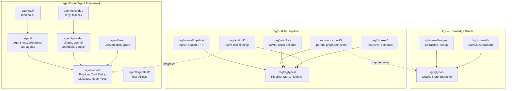

<p align="center">
  <h1 align="center">graph-agent-dev-kit</h1>
  <p align="center">
    A unified Go SDK for building streaming AI agents, knowledge graphs, and RAG pipelines.
    <br /><br />
    <a href="https://pkg.go.dev/github.com/urmzd/graph-agent-dev-kit">Install</a>
    &middot;
    <a href="https://github.com/urmzd/graph-agent-dev-kit/issues">Report Bug</a>
    &middot;
    <a href="https://pkg.go.dev/github.com/urmzd/graph-agent-dev-kit">Go Docs</a>
  </p>
</p>

<p align="center">
  <a href="https://github.com/urmzd/graph-agent-dev-kit/actions/workflows/ci.yml"></a>
</p>

## Showcase

<p align="center">
  
</p>

## Why?

Building AI applications typically requires wiring together three separate concerns:

- **Agent orchestration** — streaming LLM loops, tool dispatch, sub-agents, provider failover.
- **Knowledge graphs** — entity extraction, relation storage, hybrid search across structured knowledge.
- **RAG pipelines** — document ingestion, chunking, multi-retriever fusion, reranking, citations.

These concerns are deeply interconnected — RAG pipelines benefit from knowledge graph retrieval, agents need both for grounded responses, and all three share LLM providers and embedding models.

**graph-agent-dev-kit** unifies them into a single Go module with shared interfaces:

| Problem | Solution |
|---------|----------|
| Separate agent/KG/RAG libraries with incompatible types | Single module, shared `Provider`, `Embedder`, `Tool` interfaces |
| Untyped LLM streaming | Sealed `Delta` interface with 14 concrete types |
| Manual entity extraction | LLM-powered extraction pipeline with fuzzy dedup |
| Fragmented retrieval | Vector + BM25 + graph retrieval with RRF fusion |
| No reranking | MMR diversity + cross-encoder reranking built in |
| No feedback loop | RLHF-ready feedback as permanent leaf nodes in the conversation tree |
| Provider lock-in | Ollama, OpenAI, Anthropic, Google — one interface |

## Quick Start

```bash
go get github.com/urmzd/graph-agent-dev-kit
```

### Build an Agent

```go
import (
    "github.com/urmzd/graph-agent-dev-kit/agent"
    "github.com/urmzd/graph-agent-dev-kit/agent/core"
    "github.com/urmzd/graph-agent-dev-kit/agent/provider/ollama"
)

client := ollama.NewClient("http://localhost:11434", "qwen2.5", "nomic-embed-text")
a := agent.NewAgent(agent.AgentConfig{
    Name:         "assistant",
    SystemPrompt: "You are a helpful assistant.",
    Provider:     ollama.NewAdapter(client),
    Tools:        core.NewToolRegistry(myTool),
})

stream := a.Invoke(ctx, []core.Message{core.NewUserMessage("Hello!")})
for delta := range stream.Deltas() {
    switch d := delta.(type) {
    case core.TextContentDelta:
        fmt.Print(d.Content)
    }
}
```

### Build a Knowledge Graph

```go
import (
    "github.com/urmzd/graph-agent-dev-kit/kg"
    "github.com/urmzd/graph-agent-dev-kit/kg/kgtypes"
    "github.com/urmzd/graph-agent-dev-kit/agent/provider/ollama"
)

client := ollama.NewClient("http://localhost:11434", "qwen2.5", "nomic-embed-text")
graph, _ := kg.NewGraph(ctx,
    kg.WithSurrealDB("ws://localhost:8000", "default", "knowledge", "root", "root"),
    kg.WithExtractor(kg.NewOllamaExtractor(client)),
    kg.WithEmbedder(kg.NewOllamaEmbedder(client)),
)
defer graph.Close(ctx)

graph.IngestEpisode(ctx, &kgtypes.EpisodeInput{
    Name: "meeting-notes",
    Body: "Alice presented the Q4 roadmap. Bob raised concerns about the timeline.",
})

results, _ := graph.SearchFacts(ctx, "Who presented the roadmap?")
```

### Build a RAG Pipeline

```go
import (
    "github.com/urmzd/graph-agent-dev-kit/rag"
    "github.com/urmzd/graph-agent-dev-kit/rag/ragtypes"
    "github.com/urmzd/graph-agent-dev-kit/rag/memstore"
)

pipe, _ := rag.NewPipeline(
    rag.WithStore(memstore.New()),
    rag.WithContentExtractor(myExtractor),
    rag.WithEmbedders(myEmbedderRegistry),
    rag.WithRecursiveChunker(512, 50),
    rag.WithBM25(nil),
    rag.WithMMR(0.7),
)
defer pipe.Close(ctx)

pipe.Ingest(ctx, &ragtypes.RawDocument{
    SourceURI: "https://example.com/paper.pdf",
    Data:      pdfBytes,
})

result, _ := pipe.Search(ctx, "attention mechanism", ragtypes.WithLimit(5))
fmt.Println(result.AssembledContext.Prompt) // context with citations
```

---

## Table of Contents

- [agent — AI Agent Framework](#agent--ai-agent-framework) (providers, deltas, tools, sub-agents, markers, feedback/RLHF, compaction, tree, TUI)
- [kg — Knowledge Graph SDK](#kg--knowledge-graph-sdk)
- [rag — RAG Pipeline SDK](#rag--rag-pipeline-sdk)
- [Examples](#examples)
- [Agent Skill](#agent-skill)
- [Architecture](#architecture)

---

## agent — AI Agent Framework

Streaming-first agent loop with parallel tool execution, sub-agent delegation, human-in-the-loop markers, conversation tree persistence, and multi-provider resilience.

### Provider Interface

Implement one method to integrate any LLM backend:

```go
type Provider interface {
    ChatStream(ctx context.Context, messages []Message, tools []ToolDef) (<-chan Delta, error)
}
```

**Built-in providers:**

| Provider | Package | Structured Output | Content Negotiation | Embedder |
|----------|---------|:-:|:-:|:-:|
| Ollama | `agent/provider/ollama` | yes | JPEG, PNG | yes |
| OpenAI | `agent/provider/openai` | yes | JPEG, PNG, GIF, WebP, PDF | yes |
| Anthropic | `agent/provider/anthropic` | yes | JPEG, PNG, GIF, WebP, PDF | — |
| Google | `agent/provider/google` | yes | JPEG, PNG, GIF, WebP, PDF | yes |

### Messages

Three roles. Tool results are content blocks, not a separate role.

| Type | Role | Content Types |
|------|------|---------------|
| `SystemMessage` | system | `TextContent`, `ToolResultContent`, `ConfigContent` |
| `UserMessage` | user | `TextContent`, `ToolResultContent`, `ConfigContent`, `FileContent` |
| `AssistantMessage` | assistant | `TextContent`, `ToolUseContent` |

### Deltas

15 concrete types across five categories — LLM-side, execution-side, marker, feedback, and metadata:

| Type | Category | Purpose |
|------|----------|---------|
| `TextStartDelta` | LLM | Text block opened |
| `TextContentDelta` | LLM | Text chunk |
| `TextEndDelta` | LLM | Text block closed |
| `ToolCallStartDelta` | LLM | Tool call generation started |
| `ToolCallArgumentDelta` | LLM | JSON argument chunk |
| `ToolCallEndDelta` | LLM | Tool call complete |
| `ToolExecStartDelta` | Execution | Tool began executing |
| `ToolExecDelta` | Execution | Streaming delta from tool/sub-agent |
| `ToolExecEndDelta` | Execution | Tool finished |
| `MarkerDelta` | Marker | Tool gated pending approval |
| `FeedbackDelta` | Feedback | RLHF rating recorded on a node |
| `UsageDelta` | Metadata | Token usage + wall-clock timing |
| `ErrorDelta` | Terminal | Provider or tool error |
| `DoneDelta` | Terminal | Stream complete |

### Tools

```go
tool := &core.ToolFunc{
    Def: core.ToolDef{
        Name:        "greet",
        Description: "Greet a person",
        Parameters: core.ParameterSchema{
            Type:     "object",
            Required: []string{"name"},
            Properties: map[string]core.PropertyDef{
                "name": {Type: "string", Description: "Person's name"},
            },
        },
    },
    Fn: func(ctx context.Context, args map[string]any) (string, error) {
        return fmt.Sprintf("Hello, %s!", args["name"]), nil
    },
}
```

When the LLM requests multiple tool calls, all tools execute **concurrently**.

### Sub-Agents

Sub-agents are registered as tools and execute within parallel tool dispatch. Their deltas are forwarded through the parent's stream:

```go
a := agent.NewAgent(agent.AgentConfig{
    Provider: adapter,
    SubAgents: []agent.SubAgentDef{
        {
            Name:         "researcher",
            Description:  "Searches the web for information",
            SystemPrompt: "You are a research assistant.",
            Provider:     adapter,
            Tools:        core.NewToolRegistry(searchTool),
        },
    },
})
```

### Markers (Human-in-the-Loop)

Gate tool execution pending consumer approval:

```go
safeTool := core.WithMarkers(myTool,
    core.Marker{Kind: "human_approval", Message: "This modifies production data."},
)

// Consumer resolves:
stream.ResolveMarker(d.ToolCallID, approved, nil)
```

### Structured Output

Constrain LLM responses to a JSON schema:

```go
schema := core.SchemaFrom[MyResponse]()
a := agent.NewAgent(agent.AgentConfig{
    Provider:       adapter,
    ResponseSchema: schema,
})
```

### Provider Resilience

```go
import (
    "github.com/urmzd/graph-agent-dev-kit/agent/provider/retry"
    "github.com/urmzd/graph-agent-dev-kit/agent/provider/fallback"
)

provider := fallback.New(
    retry.New(primary, retry.DefaultConfig()),
    retry.New(backup, retry.DefaultConfig()),
)
```

### Compaction

Data-driven context management:

| Strategy | Behavior |
|----------|----------|
| `CompactNone` | No compaction |
| `CompactSlidingWindow` | Keep system prompt + last N messages |
| `CompactSummarize` | Summarize older messages via the provider |

### Conversation Tree

Persistent branching conversation graph with checkpoints, rewind, and archive:

```go
tr := a.Tree()
tr.Branch(nodeID, "experiment", msg)
tr.Checkpoint(branchID, "before-refactor")
tr.Rewind(checkpointID)
```

### Feedback (RLHF)

Attach positive/negative ratings and comments to any node in the conversation tree. Feedback is stored as permanent leaf nodes branching off the target — never sent to the LLM, available for post-analysis and training.

```go
// Rate an assistant response.
tip, _ := a.Tree().Tip(a.Tree().Active())
a.Feedback(tip.ID, core.RatingPositive, "Clear and helpful")
a.Feedback(tip.ID, core.RatingNegative, "Too verbose")

// Collect all feedback across the tree.
for _, entry := range a.FeedbackSummary() {
    fmt.Printf("node=%s rating=%d comment=%q\n",
        entry.TargetNodeID, entry.Rating, entry.Comment)
}
```

Feedback nodes have `NodeFeedback` state — they cannot have children added, forming dead-end branches that don't interfere with the conversation flow. During `Replay`, feedback emits `FeedbackDelta` for consumers that track ratings.

### File Pipeline

Automatic URI resolution and content negotiation for multi-modal input:

```go
a := agent.NewAgent(agent.AgentConfig{
    Provider: adapter,
    Resolvers: map[string]core.Resolver{
        "file": myFileResolver,
        "s3":   myS3Resolver,
    },
    Extractors: map[core.MediaType]core.Extractor{
        core.MediaPDF: myPDFExtractor,
    },
})
```

### TUI

Two display modes for streaming agent progress:

```go
import "github.com/urmzd/graph-agent-dev-kit/agent/tui"

// Non-interactive (works in pipes/CI)
result := tui.StreamVerbose(header, stream.Deltas(), os.Stdout)

// Interactive (bubbletea)
model := tui.NewStreamModel(header, stream.Deltas())
tea.NewProgram(model).Run()
```

### Testing

```go
import "github.com/urmzd/graph-agent-dev-kit/agent/agenttest"

provider := &agenttest.ScriptedProvider{
    Responses: [][]core.Delta{
        agenttest.ToolCallResponse("id-1", "greet", map[string]any{"name": "Alice"}),
        agenttest.TextResponse("Hello, Alice!"),
    },
}
```

---

## kg — Knowledge Graph SDK

Build and query knowledge graphs with LLM-powered entity extraction, fuzzy deduplication, and hybrid search.

### Graph Interface

```go
type Graph interface {
    ApplyOntology(ctx, ontology) error
    IngestEpisode(ctx, episode) (*IngestResult, error)
    GetEntity(ctx, uuid) (*Entity, error)
    SearchFacts(ctx, query, opts...) (*SearchFactsResult, error)
    GetGraph(ctx) (*GraphData, error)
    GetNode(ctx, uuid, depth) (*NodeDetail, error)
    GetFactProvenance(ctx, factID) ([]Episode, error)
    Close(ctx) error
}
```

### Core Types

| Type | Purpose |
|------|---------|
| `Entity` | Node — UUID, Name, Type, Summary, Embedding |
| `Relation` | Edge — Source/Target UUID, Type, Fact, ValidAt/InvalidAt |
| `Fact` | Relation with resolved source/target entities |
| `Episode` | Text input with Name, Body, Source, GroupID, Metadata |
| `Ontology` | Schema constraints — EntityTypes, RelationTypes |

### Hybrid Search

Combines vector similarity (HNSW) and full-text (BM25) via **Reciprocal Rank Fusion**:

```go
results, _ := graph.SearchFacts(ctx, "Who works at Acme?",
    kgtypes.WithLimit(10),
    kgtypes.WithGroupID("project-alpha"),
)
for _, fact := range kg.FactsToStrings(results.Facts) {
    fmt.Println(fact) // "Alice -> Acme Corp: works at"
}
```

### Deduplication

- **Exact match** by (name, type) pair
- **Fuzzy match** via Levenshtein distance (threshold 0.8)
- **Relation dedup** by text similarity (threshold 0.92)

### Graph Traversal

```go
detail, _ := graph.GetNode(ctx, entityUUID, 2) // BFS to depth 2
sub := kg.Subgraph(detail)                      // extract visualization data
```

### SurrealDB Backend

Automatic schema provisioning with HNSW vector index (768D cosine), BM25 fulltext indexes, unique constraints, and temporal tracking.

---

## rag — RAG Pipeline SDK

Multi-modal document ingestion with pluggable chunking, retrieval, reranking, and context assembly.

### Data Model

```
Document (fingerprint for dedup, metadata, source URI)
  └── Section[] (ordered by index, optional heading)
        └── ContentVariant[] (text, image, table, audio — each with bytes, embedding, MIME)
```

Every `ContentVariant` has a `.Text` field that is always populated, enabling uniform search and entity extraction.

### Pipeline Interface

```go
type Pipeline interface {
    Ingest(ctx, raw) (*IngestResult, error)
    Search(ctx, query, opts...) (*SearchPipelineResult, error)
    Lookup(ctx, variantUUID) (*SearchHit, error)
    Update(ctx, documentUUID, raw) (*IngestResult, error)
    Delete(ctx, documentUUID) error
    Reconstruct(ctx, documentUUID) (*Document, error)
    Close(ctx) error
}
```

### Chunking

| Strategy | Description |
|----------|-------------|
| Recursive | Tries separators (`\n\n`, `\n`, `. `, ` `) with configurable overlap |
| Semantic | Splits where embedding similarity drops below threshold |

```go
rag.WithRecursiveChunker(512, 50)     // maxSize, overlap
rag.WithSemanticChunker(0.1, 100, 1000) // threshold, minSize, maxSize
```

### Retrieval

| Retriever | Description |
|-----------|-------------|
| Vector | Embed query, cosine similarity search |
| BM25 | In-memory inverted index with configurable K1/B |
| Graph | Knowledge graph facts resolved to document variants via episode provenance |
| Parent | Wraps any retriever, expands hits to full parent section context |

Multiple retrievers are combined via **Reciprocal Rank Fusion**.

```go
rag.WithBM25(nil)          // default K1=1.2, B=0.75
rag.WithParentContext()    // expand to parent sections
```

### Reranking

| Reranker | Description |
|----------|-------------|
| MMR | Maximal Marginal Relevance — balances relevance and diversity |
| Cross-Encoder | Pair-wise scoring via custom `Scorer` interface |

```go
rag.WithMMR(0.7)                    // lambda=0.7
rag.WithCrossEncoder(myScorer)      // custom scorer
```

### Context Assembly

Built-in citation support:

```go
// Default: numbered citations with source URIs
// Compressing: LLM-based extraction of relevant sentences
rag.WithCompression(myLLM)
```

### Query Transformation

**HyDE** (Hypothetical Document Embeddings) — generates hypothetical documents via LLM for better retrieval:

```go
rag.WithHyDE(myLLM, 3) // generate 3 hypothetical docs
```

### Evaluation Metrics

```go
import "github.com/urmzd/graph-agent-dev-kit/rag/rageval"

precision := rageval.ContextPrecision(results, relevantUUIDs)
recall := rageval.ContextRecall(results, relevantUUIDs)
faithfulness, _ := rageval.Faithfulness(ctx, llm, query, answer, context)
relevancy, _ := rageval.AnswerRelevancy(ctx, embedder, query, answer)
```

### ADK Tool Bindings

5 tools for integrating RAG into agent workflows:

```go
import "github.com/urmzd/graph-agent-dev-kit/rag/adktool"

tools := adktool.NewTools(pipeline)
// rag_search, rag_lookup, rag_update, rag_delete, rag_reconstruct
```

---

## Examples

| Example | Path | Description |
|---------|------|-------------|
| Basic Agent | `examples/agent/basic/` | Single tool with Ollama |
| Sub-agents | `examples/agent/subagents/` | Parent delegating to researcher |
| Resilient | `examples/agent/resilient/` | Retry + fallback composition |
| Streaming | `examples/agent/streaming/` | All delta types with ANSI output |
| Multimodal | `examples/agent/multimodal/` | File pipeline with `file://` resolver |
| TUI | `examples/agent/tui/` | Interactive and verbose modes |
| Runner | `examples/agent/runner/` | Multi-turn conversation loop |
| Concurrent | `examples/agent/concurrent-subagents/` | Parallel sub-agent execution |
| Knowledge Graph | `examples/kg/basic/` | Build and query a knowledge graph |
| RAG | `examples/rag/arxiv/` | Full pipeline with arXiv papers |

```bash
go run ./examples/agent/basic/
go run ./examples/kg/basic/
go run ./examples/rag/arxiv/
```

## Agent Skill

```bash
npx skills add urmzd/graph-agent-dev-kit
```

## Architecture



| Package | Files | Purpose |
|---------|-------|---------|
| `agent/` | `agent.go`, `stream.go`, `subagent.go`, `aggregator.go`, `runner.go` | Agent loop, streaming, sub-agent delegation |
| `agent/core/` | `message.go`, `delta.go`, `content.go`, `provider.go`, `tool.go`, `errors.go`, `marker.go`, `compactor.go`, `node.go` | Sealed types, interfaces, error classification, feedback |
| `agent/tree/` | `tree.go`, `flatten.go`, `compact.go`, `diff.go` | Branching conversation tree with feedback leaf nodes |
| `agent/provider/` | `ollama/`, `openai/`, `anthropic/`, `google/`, `retry/`, `fallback/` | LLM adapters and resilience wrappers |
| `agent/tui/` | `stream.go`, `styles.go`, `runner.go` | Bubbletea + verbose streaming UI |
| `agent/agenttest/` | `agenttest.go` | ScriptedProvider, MockTool, assertions |
| `kg/` | `config.go`, `query.go`, `ollama.go` | Knowledge graph public API |
| `kg/kgtypes/` | `kgtypes.go` | Core KG types and interfaces |
| `kg/surrealdb/` | `store.go`, `schema.go`, `records.go` | SurrealDB store implementation |
| `kg/internal/` | `engine/`, `extraction/`, `fuzzy/` | Engine orchestration, LLM extraction, dedup |
| `rag/` | `config.go`, `version.go` | RAG pipeline configuration |
| `rag/ragtypes/` | `ragtypes.go` | Core RAG types and interfaces |
| `rag/internal/` | `pipeline/pipeline.go` | Pipeline engine (ingest, search, RRF) |
| `rag/chunker/` | `chunker.go`, `semantic.go` | Recursive and semantic chunking |
| `rag/bm25retriever/` | `retriever.go` | In-memory BM25 lexical search |
| `rag/vectorretriever/` | `retriever.go` | Vector similarity search |
| `rag/graphretriever/` | `retriever.go` | Knowledge graph retrieval |
| `rag/parentretriever/` | `retriever.go` | Parent context expansion |
| `rag/reranker/` | `mmr.go`, `crossencoder.go` | MMR + cross-encoder reranking |
| `rag/hyde/` | `transformer.go` | HyDE query expansion |
| `rag/contextassembler/` | `compressing.go` | LLM-based context compression |
| `rag/rageval/` | `eval.go` | Evaluation metrics |
| `rag/adktool/` | `tools.go` | ADK tool bindings |
| `rag/memstore/` | `store.go` | In-memory store for testing |

## License

Apache 2.0 — see [LICENSE](LICENSE).
