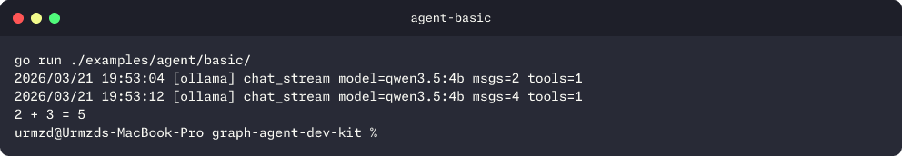

<p align="center">
  <h1 align="center">saige</h1>
  <p align="center">
    <strong>Super Artificial Intelligence Graph Environment</strong>
    <br />
    A unified Go SDK for streaming AI agents, knowledge graphs, and RAG pipelines.
    <br /><br />
    <a href="https://pkg.go.dev/github.com/urmzd/saige">Install</a>
    &middot;
    <a href="https://github.com/urmzd/saige/issues">Report Bug</a>
    &middot;
    <a href="https://pkg.go.dev/github.com/urmzd/saige">Go Docs</a>
  </p>
</p>

<p align="center">
  <a href="https://github.com/urmzd/saige/actions/workflows/ci.yml"></a>
  <a href="https://pkg.go.dev/github.com/urmzd/saige"></a>
  <a href="LICENSE"></a>
</p>

## Showcase

<p align="center">
  
</p>

## Features

- **Streaming-first agent loop** with 15 typed delta events and parallel tool execution
- **Functional options** — compose agents incrementally with `AgentOption` functions
- **Conversation tree** with branching, checkpoints, rewind, and RLHF feedback — all context-aware
- **Sub-agent delegation** — stateless child agents as tools, deltas forwarded with attribution
- **Human-in-the-loop markers** — gate tool execution pending approval
- **Structured tool errors** — `IsError` flag on tool results, distinguishable from successful output
- **Knowledge graph construction** — LLM-powered entity extraction, fuzzy dedup, temporal tracking
- **Multi-retriever RAG** — vector + BM25 + graph retrieval fused via Reciprocal Rank Fusion
- **Reranking** — MMR diversity and cross-encoder scoring built in
- **4 LLM providers** (Ollama, OpenAI, Anthropic, Google) behind one `Provider` interface
- **Provider resilience** — retry + fallback composition out of the box
- **Structured output** — constrain LLM responses to JSON schema
- **Universal evaluation** — composable `Scorer` interface, A/B experiment runner, text quality metrics, LLM-as-judge, and subsystem-specific scorers for agent, RAG, and knowledge graph

### Why one SDK?

Agent orchestration, knowledge graphs, and RAG pipelines are deeply interconnected — RAG benefits from graph retrieval, agents need both for grounded responses, and all three share providers and embedders. **saige** unifies them under shared `Provider`, `Embedder`, and `Tool` interfaces, eliminating the wiring complexity of combining separate libraries.

## Quick Start

```bash
go get github.com/urmzd/saige
```

### CLI

The `saige` CLI provides two interaction modes plus standalone RAG/KG operations:

```bash
# Interactive multi-turn chat (Bubble Tea TUI)
saige chat
saige chat --provider anthropic --model claude-sonnet-4-6-20250514
saige chat --verbose  # plain-text mode for pipes/CI

# Single-shot question (pipe-friendly)
saige ask "What is retrieval-augmented generation?"
echo "Explain transformers" | saige ask --raw

# With RAG/KG tools attached to the agent
saige chat --rag-db "postgres://localhost/mydb" --kg-db "postgres://localhost/mydb"
saige ask --rag-db "$SAIGE_RAG_DB" "What does the paper say about attention?"

# Standalone RAG operations (JSON output)
saige rag ingest --db "$SAIGE_RAG_DB" --file paper.pdf --mime application/pdf
saige rag search --db "$SAIGE_RAG_DB" --query "attention mechanism"
saige rag lookup --db "$SAIGE_RAG_DB" --uuid <variant-uuid>
saige rag delete --db "$SAIGE_RAG_DB" --uuid <doc-uuid>

# Standalone KG operations (JSON output)
saige kg ingest --db "$SAIGE_KG_DB" --name "meeting" --text "Alice presented the roadmap."
saige kg search --db "$SAIGE_KG_DB" --query "Who presented?"
saige kg graph  --db "$SAIGE_KG_DB" --limit 50
saige kg node   --db "$SAIGE_KG_DB" --id <entity-uuid> --depth 2
```

**Provider auto-detection:** The CLI checks for `ANTHROPIC_API_KEY`, `OPENAI_API_KEY`, `GOOGLE_API_KEY` in order, falling back to Ollama (no key needed). Override with `--provider` or `SAIGE_PROVIDER`.

### Build an Agent

```go
import (
    "github.com/urmzd/saige/agent"
    "github.com/urmzd/saige/agent/types"
    "github.com/urmzd/saige/agent/provider/ollama"
)

client := ollama.NewClient("http://localhost:11434", "qwen2.5", "nomic-embed-text")
a := agent.NewAgent(agent.AgentConfig{
    Name:         "assistant",
    SystemPrompt: "You are a helpful assistant.",
    Provider:     ollama.NewAdapter(client),
    Tools:        types.NewToolRegistry(myTool),
})

// Or compose incrementally with functional options:
a := agent.NewAgent(agent.AgentConfig{
    Name:         "assistant",
    SystemPrompt: "You are a helpful assistant.",
    Provider:     ollama.NewAdapter(client),
    Tools:        types.NewToolRegistry(myTool),
},
    agent.WithMaxIter(20),
    agent.WithLogger(slog.Default()),
    agent.WithMetrics(myMetrics),
)

stream := a.Invoke(ctx, []types.Message{types.NewUserMessage("Hello!")})
for delta := range stream.Deltas() {
    switch d := delta.(type) {
    case types.TextContentDelta:
        fmt.Print(d.Content)
    }
}
```

### Build a Knowledge Graph

```go
import (
    "github.com/urmzd/saige/knowledge"
    "github.com/urmzd/saige/knowledge/types"
    "github.com/urmzd/saige/postgres"
    "github.com/urmzd/saige/agent/provider/ollama"
)

// Connect to PostgreSQL (requires pgvector extension).
pool, _ := postgres.NewPool(ctx, postgres.Config{URL: "postgres://localhost:5432/mydb"})
postgres.RunMigrations(ctx, pool, postgres.MigrationOptions{})

client := ollama.NewClient("http://localhost:11434", "qwen2.5", "nomic-embed-text")
graph, _ := knowledge.NewGraph(ctx,
    knowledge.WithPostgres(pool),
    knowledge.WithExtractor(knowledge.NewOllamaExtractor(client)),
    knowledge.WithEmbedder(knowledge.NewOllamaEmbedder(client)),
)
defer graph.Close(ctx)

graph.IngestEpisode(ctx, &types.EpisodeInput{
    Name: "meeting-notes",
    Body: "Alice presented the Q4 roadmap. Bob raised concerns about the timeline.",
})

results, _ := graph.SearchFacts(ctx, "Who presented the roadmap?")
```

### Build a RAG Pipeline

```go
import (
    "github.com/urmzd/saige/rag"
    "github.com/urmzd/saige/rag/types"
    "github.com/urmzd/saige/rag/pgstore"
    "github.com/urmzd/saige/postgres"
)

// Reuse the same PostgreSQL pool (or create a new one).
pool, _ := postgres.NewPool(ctx, postgres.Config{URL: "postgres://localhost:5432/mydb"})
postgres.RunMigrations(ctx, pool, postgres.MigrationOptions{})

pipe, _ := rag.NewPipeline(
    rag.WithStore(pgstore.NewStore(pool, nil)),
    rag.WithContentExtractor(myExtractor),
    rag.WithEmbedders(myEmbedderRegistry),
    rag.WithRecursiveChunker(512, 50),
    rag.WithBM25(nil),
    rag.WithMMR(0.7),
)
defer pipe.Close(ctx)

pipe.Ingest(ctx, &types.RawDocument{
    SourceURI: "https://example.com/paper.pdf",
    Data:      pdfBytes,
})

result, _ := pipe.Search(ctx, "attention mechanism", types.WithLimit(5))
fmt.Println(result.AssembledContext.Prompt) // context with citations
```

---

## Table of Contents

- [CLI](#cli)
- [agent — AI Agent Framework](#agent--ai-agent-framework) (providers, deltas, tools, sub-agents, markers, feedback/RLHF, compaction, tree, TUI)
- [kg — Knowledge Graph SDK](#kg--knowledge-graph-sdk)
- [rag — RAG Pipeline SDK](#rag--rag-pipeline-sdk)
- [eval — Universal Evaluation Framework](#eval--universal-evaluation-framework)
- [Examples](#examples)
- [Agent Skill](#agent-skill)

---

## agent — AI Agent Framework

Streaming-first agent loop with parallel tool execution, sub-agent delegation, human-in-the-loop markers, conversation tree persistence, and multi-provider resilience.

### Provider Interface

Implement one method to integrate any LLM backend:

```go
type Provider interface {
    ChatStream(ctx context.Context, messages []Message, tools []ToolDef) (<-chan Delta, error)
}
```

**Built-in providers:**

| Provider | Package | Structured Output | Content Negotiation | Embedder |
|----------|---------|:-:|:-:|:-:|
| Ollama | `agent/provider/ollama` | yes | JPEG, PNG | yes |
| OpenAI | `agent/provider/openai` | yes | JPEG, PNG, GIF, WebP, PDF | yes |
| Anthropic | `agent/provider/anthropic` | yes | JPEG, PNG, GIF, WebP, PDF | — |
| Google | `agent/provider/google` | yes | JPEG, PNG, GIF, WebP, PDF | yes |

### Messages

Three roles. Tool results are content blocks, not a separate role.

| Type | Role | Content Types |
|------|------|---------------|
| `SystemMessage` | system | `TextContent`, `ToolResultContent`, `ConfigContent` |
| `UserMessage` | user | `TextContent`, `ToolResultContent`, `ConfigContent`, `FileContent` |
| `AssistantMessage` | assistant | `TextContent`, `ToolUseContent` |

`ToolResultContent` carries an `IsError` field that signals whether the text represents an error or a successful result. This distinction is preserved through to the LLM — Anthropic passes it natively, Google uses an `error` key in the function response, and OpenAI/Ollama prefix the text with `[TOOL ERROR]`.

### Deltas

15 concrete types across five categories — LLM-side, execution-side, marker, feedback, and metadata:

| Type | Category | Purpose |
|------|----------|---------|
| `TextStartDelta` | LLM | Text block opened |
| `TextContentDelta` | LLM | Text chunk |
| `TextEndDelta` | LLM | Text block closed |
| `ToolCallStartDelta` | LLM | Tool call generation started |
| `ToolCallArgumentDelta` | LLM | JSON argument chunk |
| `ToolCallEndDelta` | LLM | Tool call complete |
| `ToolExecStartDelta` | Execution | Tool began executing |
| `ToolExecDelta` | Execution | Streaming delta from tool/sub-agent |
| `ToolExecEndDelta` | Execution | Tool finished |
| `MarkerDelta` | Marker | Tool gated pending approval |
| `FeedbackDelta` | Feedback | RLHF rating recorded on a node |
| `UsageDelta` | Metadata | Token usage + wall-clock timing |
| `ErrorDelta` | Terminal | Provider or tool error |
| `DoneDelta` | Terminal | Stream complete |

### Tools

```go
tool := &types.ToolFunc{
    Def: types.ToolDef{
        Name:        "greet",
        Description: "Greet a person",
        Parameters: types.ParameterSchema{
            Type:     "object",
            Required: []string{"name"},
            Properties: map[string]types.PropertyDef{
                "name": {Type: "string", Description: "Person's name"},
            },
        },
    },
    Fn: func(ctx context.Context, args map[string]any) (string, error) {
        return fmt.Sprintf("Hello, %s!", args["name"]), nil
    },
}
```

When the LLM requests multiple tool calls, all tools execute **concurrently**.

### Sub-Agents

Sub-agents are registered as tools and execute within parallel tool dispatch. Their deltas are forwarded through the parent's stream. **Sub-agents are stateless** — a fresh agent is constructed for each delegation, so conversation history is not preserved between calls. This is intentional: sub-agents are task executors, not persistent conversational partners.

```go
a := agent.NewAgent(agent.AgentConfig{
    Provider: adapter,
    SubAgents: []agent.SubAgentDef{
        {
            Name:         "researcher",
            Description:  "Searches the web for information",
            SystemPrompt: "You are a research assistant.",
            Provider:     adapter,
            Tools:        types.NewToolRegistry(searchTool),
        },
    },
})
```

### Markers (Human-in-the-Loop)

Gate tool execution pending consumer approval:

```go
safeTool := types.WithMarkers(myTool,
    types.Marker{Kind: "human_approval", Message: "This modifies production data."},
)

// Consumer resolves:
stream.ResolveMarker(d.ToolCallID, approved, nil)
```

### Structured Output

Constrain LLM responses to a JSON schema:

```go
schema := types.SchemaFrom[MyResponse]()
a := agent.NewAgent(agent.AgentConfig{
    Provider: adapter,
}, agent.WithResponseSchema(schema))
```

### Provider Resilience

```go
import (
    "github.com/urmzd/saige/agent/provider/retry"
    "github.com/urmzd/saige/agent/provider/fallback"
)

provider := fallback.New(
    retry.New(primary, retry.DefaultConfig()),
    retry.New(backup, retry.DefaultConfig()),
)
```

### Compaction

Data-driven context management:

| Strategy | Behavior |
|----------|----------|
| `CompactNone` | No compaction |
| `CompactSlidingWindow` | Keep system prompt + last N messages |
| `CompactSummarize` | Summarize older messages via the provider |

### Conversation Tree

Persistent branching conversation graph with checkpoints, rewind, and archive. All mutation methods (`AddChild`, `Branch`, `UpdateUserMessage`, `AddFeedback`) accept a `context.Context` for cancellation, deadlines, and tracing — including WAL writes:

```go
tr := a.Tree()
tr.AddChild(ctx, parentID, msg)
tr.Branch(ctx, nodeID, "experiment", msg)
tr.UpdateUserMessage(ctx, nodeID, newMsg)
tr.Checkpoint(branchID, "before-refactor")
tr.Rewind(checkpointID)
```

### Feedback (RLHF)

Attach positive/negative ratings and comments to any node in the conversation tree. Feedback is stored as permanent leaf nodes branching off the target — never sent to the LLM, available for post-analysis and training.

```go
// Rate an assistant response.
tip, _ := a.Tree().Tip(a.Tree().Active())
a.Feedback(ctx, tip.ID, types.RatingPositive, "Clear and helpful")
a.Feedback(ctx, tip.ID, types.RatingNegative, "Too verbose")

// Collect all feedback across the tree.
for _, entry := range a.FeedbackSummary() {
    fmt.Printf("node=%s rating=%d comment=%q\n",
        entry.TargetNodeID, entry.Rating, entry.Comment)
}
```

Feedback nodes have `NodeFeedback` state — they cannot have children added, forming dead-end branches that don't interfere with the conversation flow. During `Replay`, feedback emits `FeedbackDelta` for consumers that track ratings.

### File Pipeline

Automatic URI resolution and content negotiation for multi-modal input:

```go
a := agent.NewAgent(agent.AgentConfig{
    Provider: adapter,
},
    agent.WithResolvers(map[string]types.Resolver{
        "file": myFileResolver,
        "s3":   myS3Resolver,
    }),
    agent.WithExtractors(map[types.MediaType]types.Extractor{
        types.MediaPDF: myPDFExtractor,
    }),
)
```

### TUI

Three modes for streaming agent interaction:

```go
import "github.com/urmzd/saige/agent/tui"

// Non-interactive (works in pipes/CI)
result := tui.StreamVerbose(header, stream.Deltas(), os.Stdout)

// Interactive single-stream (bubbletea)
model := tui.NewStreamModel(header, stream.Deltas())
tea.NewProgram(model).Run()

// Multi-turn conversation loop (reads input, resolves markers, loops until /quit)
runner := &tui.Runner{Title: "My Agent"}
runner.Run(ctx, myAgent)
```

### Testing

```go
import "github.com/urmzd/saige/agent/agenttest"

provider := &agenttest.ScriptedProvider{
    Responses: [][]types.Delta{
        agenttest.ToolCallResponse("id-1", "greet", map[string]any{"name": "Alice"}),
        agenttest.TextResponse("Hello, Alice!"),
    },
}
```

---

## knowledge — Knowledge Graph SDK

Build and query knowledge graphs with LLM-powered entity extraction, fuzzy deduplication, and hybrid search.

### Graph Interface

```go
type Graph interface {
    ApplyOntology(ctx, ontology) error
    IngestEpisode(ctx, episode) (*IngestResult, error)
    GetEntity(ctx, uuid) (*Entity, error)
    SearchFacts(ctx, query, opts...) (*SearchFactsResult, error)
    GetGraph(ctx) (*GraphData, error)
    GetNode(ctx, uuid, depth) (*NodeDetail, error)
    GetFactProvenance(ctx, factID) ([]Episode, error)
    Close(ctx) error
}
```

### Core Types

| Type | Purpose |
|------|---------|
| `Entity` | Node — UUID, Name, Type, Summary, Embedding |
| `Relation` | Edge — Source/Target UUID, Type, Fact, ValidAt/InvalidAt |
| `Fact` | Relation with resolved source/target entities |
| `Episode` | Text input with Name, Body, Source, GroupID, Metadata |
| `Ontology` | Schema constraints — EntityTypes, RelationTypes |

### Hybrid Search

Combines vector similarity (HNSW) and full-text (BM25) via **Reciprocal Rank Fusion**:

```go
results, _ := graph.SearchFacts(ctx, "Who works at Acme?",
    types.WithLimit(10),
    types.WithGroupID("project-alpha"),
)
for _, fact := range knowledge.FactsToStrings(results.Facts) {
    fmt.Println(fact) // "Alice -> Acme Corp: works at"
}
```

### Deduplication

- **Exact match** by (name, type) pair
- **Fuzzy match** via Levenshtein distance (threshold 0.8)
- **Relation dedup** by text similarity (threshold 0.92)

### Graph Traversal

```go
detail, _ := graph.GetNode(ctx, entityUUID, 2) // BFS to depth 2
sub := knowledge.Subgraph(detail)                      // extract visualization data
```

### PostgreSQL Backend

Automatic schema provisioning via `postgres.RunMigrations` with pgvector HNSW index (configurable dimension, cosine distance), tsvector fulltext search, pg_trgm fuzzy matching, unique constraints, and temporal relation tracking.

---

## rag — RAG Pipeline SDK

Multi-modal document ingestion with pluggable chunking, retrieval, reranking, and context assembly.

### Data Model

```
Document (fingerprint for dedup, metadata, source URI)
  └── Section[] (ordered by index, optional heading)
        └── ContentVariant[] (text, image, table, audio — each with bytes, embedding, MIME)
```

Every `ContentVariant` has a `.Text` field that is always populated, enabling uniform search and entity extraction.

### Pipeline Interface

```go
type Pipeline interface {
    Ingest(ctx, raw) (*IngestResult, error)
    Search(ctx, query, opts...) (*SearchPipelineResult, error)
    Lookup(ctx, variantUUID) (*SearchHit, error)
    Update(ctx, documentUUID, raw) (*IngestResult, error)
    Delete(ctx, documentUUID) error
    Reconstruct(ctx, documentUUID) (*Document, error)
    Close(ctx) error
}
```

### Chunking

| Strategy | Description |
|----------|-------------|
| Recursive | Tries separators (`\n\n`, `\n`, `. `, ` `) with configurable overlap |
| Semantic | Splits where embedding similarity drops below threshold |

```go
rag.WithRecursiveChunker(512, 50)     // maxSize, overlap
rag.WithSemanticChunker(0.1, 100, 1000) // threshold, minSize, maxSize
```

### Retrieval

| Retriever | Description |
|-----------|-------------|
| Vector | Embed query, cosine similarity search |
| BM25 | In-memory inverted index with configurable K1/B |
| Graph | Knowledge graph facts resolved to document variants via episode provenance |
| Parent | Wraps any retriever, expands hits to full parent section context |

Multiple retrievers are combined via **Reciprocal Rank Fusion**.

```go
rag.WithBM25(nil)          // default K1=1.2, B=0.75
rag.WithParentContext()    // expand to parent sections
```

### Reranking

| Reranker | Description |
|----------|-------------|
| MMR | Maximal Marginal Relevance — balances relevance and diversity |
| Cross-Encoder | Pair-wise scoring via custom `Scorer` interface |

```go
rag.WithMMR(0.7)                    // lambda=0.7
rag.WithCrossEncoder(myScorer)      // custom scorer
```

### Context Assembly

Built-in citation support:

```go
// Default: numbered citations with source URIs
// Compressing: LLM-based extraction of relevant sentences
rag.WithCompression(myLLM)
```

### Query Transformation

**HyDE** (Hypothetical Document Embeddings) — generates hypothetical documents via LLM for better retrieval:

```go
rag.WithHyDE(myLLM, 3) // generate 3 hypothetical docs
```

### Evaluation Metrics

9 metrics across retrieval, generation, and end-to-end evaluation. These are also available as composable `Scorer` adapters for the [universal eval framework](#eval--universal-evaluation-framework) — see `rag/eval` scorer functions like `ContextPrecisionScorer()`, `FaithfulnessScorer()`, etc.

| Metric | Type | Description |
|--------|------|-------------|
| `ContextPrecision` | Retrieval | Average Precision over relevant UUIDs |
| `ContextRecall` | Retrieval | Fraction of relevant UUIDs in results |
| `NDCG` | Retrieval | Normalized Discounted Cumulative Gain at rank k |
| `MRR` | Retrieval | Reciprocal Rank of first relevant result |
| `HitRate` | Retrieval | Binary: any relevant doc in top-k? |
| `Faithfulness` | Generation | Claim decomposition + verification against context |
| `AnswerRelevancy` | Generation | RAGAS-style synthetic question similarity |
| `AnswerCorrectness` | Generation | LLM-judged comparison to ground truth |
| `LLMJudge` | Generation | Pointwise scoring with custom rubric |

```go
import "github.com/urmzd/saige/rag/eval"

// Retrieval metrics (pure functions, no LLM needed).
precision := eval.ContextPrecision(hits, relevantUUIDs)
recall := eval.ContextRecall(hits, relevantUUIDs)
ndcg := eval.NDCG(hits, relevantUUIDs, 10)
mrr := eval.MRR(hits, relevantUUIDs)
hitRate := eval.HitRate(hits, relevantUUIDs, 10)

// Generation metrics (require LLM and/or embedders).
faith, detail, _ := eval.Faithfulness(ctx, response, contextText, llm)
relevancy, _ := eval.AnswerRelevancy(ctx, query, response, llm, embedders, 3)
correctness, _ := eval.AnswerCorrectness(ctx, response, groundTruth, llm)
score, reason, _ := eval.LLMJudge(ctx, query, response, contextText, rubric, llm)

// Full evaluation pipeline with functional options.
results, _ := eval.Evaluate(ctx, cases, pipeline,
    eval.WithLLM(llm),
    eval.WithEmbedders(embedders),
    eval.WithK(10),
    eval.WithJudgeRubric("Score helpfulness, accuracy, and completeness."),
)
```

### Agent Tool Bindings

5 RAG tools and 2 KG tools for integrating into agent workflows:

```go
import (
    ragtool "github.com/urmzd/saige/rag/tool"
    kgtool "github.com/urmzd/saige/knowledge/tool"
)

ragTools := ragtool.NewTools(pipeline)
// rag_search, rag_lookup, rag_update, rag_delete, rag_reconstruct

kgTools := kgtool.NewTools(graph)
// kg_search, kg_ingest
```

---

## eval — Universal Evaluation Framework

Composable evaluation framework that works across all SAIGE subsystems. The core `eval/` package has zero subsystem dependencies — subsystem-specific scorers live alongside their domains.

### Core Abstractions

| Type | Purpose |
|------|---------|
| `Observation` | Universal eval case — Input, Output, GroundTruth as `json.RawMessage`, typed Annotations map |
| `Scorer` | Interface computing a named metric from an Observation |
| `Subject` | Function that populates an Observation's Output and Annotations |
| `Score` | Named metric value with optional reason |

### Built-in Scorers

**Text Quality** (pure functions, no LLM):

| Scorer | Description |
|--------|-------------|
| `SequenceSimilarityScorer` | Character-level LCS ratio between output and ground truth |
| `TokenF1Scorer` | Word-token precision/recall/F1 |
| `RougeLScorer` | ROUGE-L F1 at the token level |

**LLM-as-Judge**:

| Scorer | Description |
|--------|-------------|
| `NewJudgeScorer` | Pointwise scoring with customizable rubric |
| `NewPairwiseJudgeScorer` | A/B comparison between two outputs |

**Agent** (`agent/eval`):

| Scorer | Description |
|--------|-------------|
| `TTFTScorer` | Time to first token (ms) |
| `TTLTScorer` | Time to last token (ms) |
| `MedianITLScorer` | Median inter-token latency (ms) |
| `ToolCallCountScorer` | Number of tool calls |
| `ToolSuccessRateScorer` | Fraction of successful tool calls |
| `TurnCountScorer` | Agent loop iterations |

**Knowledge Graph** (`knowledge/eval`):

| Scorer | Description |
|--------|-------------|
| `EntityRecallScorer` | Fraction of expected entities extracted |
| `EntityPrecisionScorer` | Fraction of extracted entities matching expected |
| `RelationRecallScorer` | Relation extraction recall |
| `RelationPrecisionScorer` | Relation extraction precision |
| `FactSearchRecallScorer` | Fraction of relevant facts found by search |

**RAG** (`rag/eval`):

The existing 9 RAG metrics are also available as composable `Scorer` adapters: `ContextPrecisionScorer`, `ContextRecallScorer`, `NDCGScorer`, `MRRScorer`, `HitRateScorer`, `FaithfulnessScorer`, `AnswerRelevancyScorer`, `AnswerCorrectnessScorer`.

### Evaluate a Single System

```go
import "github.com/urmzd/saige/eval"

observations := []eval.Observation{
    {ID: "q1", Input: json.RawMessage(`"What is Go?"`), GroundTruth: json.RawMessage(`"A programming language."`)},
}

// Define a subject that calls the system under test.
subject := eval.Subject(func(ctx context.Context, obs *eval.Observation) error {
    // Call your system, populate obs.Output, obs.Annotations, obs.Timing
    obs.Output = json.RawMessage(`"Go is a statically typed language."`)
    return nil
})

eval.Populate(ctx, observations, subject)

result, _ := eval.Run(ctx, "my-eval", observations, []eval.Scorer{
    eval.TokenF1Scorer(),
    eval.RougeLScorer(),
    eval.NewJudgeScorer(llm, eval.WithJudgeRubric("Score for accuracy.")),
})
```

### A/B Experiment

Compare two approaches on the same inputs:

```go
result, _ := eval.RunExperiment(ctx, inputs, baseSubject, expSubject,
    []eval.Scorer{rageval.NDCGScorer(10), rageval.MRRScorer()},
    eval.WithOutputDir("experiments/bm25-vs-hyde"),
    eval.WithExperimentName("bm25-vs-hyde"),
)
// result.Deltas["ndcg"] shows the improvement
```

### Stream Timing (Agent)

Instrument a delta channel to collect TTFT, TTLT, and median ITL:

```go
import agenteval "github.com/urmzd/saige/agent/eval"

stream := myAgent.Invoke(ctx, messages)
timing, text, deltas := agenteval.CollectStreamTiming(stream.Deltas())
// timing.TTFTMs, timing.TTLTMs, timing.MedianITL
```

### On-Disk Format

Experiment results persist as structured JSON for reproducibility:

```
experiments/bm25-vs-hyde/
  result.json
  inputs/000.json
  outputs/base/000.json
  outputs/exp/000.json
```

---

## Examples

| Example | Path | Description |
|---------|------|-------------|
| Basic Agent | `examples/agent/basic/` | Single tool with Ollama |
| Sub-agents | `examples/agent/subagents/` | Parent delegating to researcher |
| Resilient | `examples/agent/resilient/` | Retry + fallback composition |
| Streaming | `examples/agent/streaming/` | All delta types with ANSI output |
| Multimodal | `examples/agent/multimodal/` | File pipeline with `file://` resolver |
| TUI | `examples/agent/tui/` | Interactive and verbose modes |
| Runner | `examples/agent/runner/` | Multi-turn conversation loop |
| Concurrent | `examples/agent/concurrent-subagents/` | Parallel sub-agent execution |
| Knowledge Graph | `examples/knowledge/basic/` | Build and query a knowledge graph |
| RAG | `examples/rag/arxiv/` | Full pipeline with arXiv papers |

```bash
go run ./examples/agent/basic/
go run ./examples/knowledge/basic/
go run ./examples/rag/arxiv/
```

## Agent Skill

This repo's conventions are available as portable agent skills in [`skills/`](skills/).

## License

Apache 2.0 — see [LICENSE](LICENSE).
