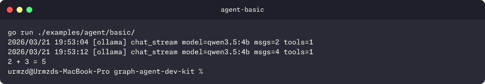

<p align="center">
  <h1 align="center">saige</h1>
  <p align="center">
    <strong>Super Artificial Intelligence Graph Environment</strong>
    <br />
    A unified Go SDK for streaming AI agents, knowledge graphs, and RAG pipelines.
    <br /><br />
    <a href="https://pkg.go.dev/github.com/urmzd/saige">Install</a>
    &middot;
    <a href="https://github.com/urmzd/saige/issues">Report Bug</a>
    &middot;
    <a href="https://pkg.go.dev/github.com/urmzd/saige">Go Docs</a>
  </p>
</p>

<p align="center">
  <a href="https://github.com/urmzd/saige/actions/workflows/ci.yml"></a>
  <a href="https://pkg.go.dev/github.com/urmzd/saige"></a>
  <a href="LICENSE"></a>
</p>

<p align="center">
  
</p>

## Features

- **Streaming-first agent loop** with typed delta events, parallel tool execution, and sub-agent delegation
- **Conversation tree** with branching, checkpoints, rewind, and RLHF feedback
- **Knowledge graph construction** with LLM-powered entity extraction, fuzzy dedup, and temporal tracking
- **Multi-retriever RAG** fusing vector, BM25, and graph retrieval via Reciprocal Rank Fusion, with reranking and citations
- **4 LLM providers** (Ollama, OpenAI, Anthropic, Google) behind one `Provider` interface, with retry and fallback composition
- **MCP server** exposing any saige tool pack to Claude Code, Codex, Gemini CLI, or any MCP client
- **Universal evaluation** with composable scorers, A/B experiments, and LLM-as-judge

### Why one SDK?

Agent orchestration, knowledge graphs, and RAG pipelines are deeply interconnected: RAG benefits from graph retrieval, agents need both for grounded responses, and all three share providers and embedders. **saige** unifies them under shared `Provider`, `Embedder`, and `Tool` interfaces, eliminating the wiring complexity of combining separate libraries.

## Installation

### Library

```bash
go get github.com/urmzd/saige
```

### CLI and MCP server

```bash
go install github.com/urmzd/saige/cmd/saige@latest
go install github.com/urmzd/saige/cmd/saige-mcp@latest
```

Or install a pre-built `saige` binary:

```bash
curl -fsSL https://raw.githubusercontent.com/urmzd/saige/main/install.sh | sh
```

## Quick Start

### CLI

```bash
saige chat                                    # interactive multi-turn chat
saige ask "What is retrieval-augmented generation?"

# Serve saige tools to Claude Code, Codex, or Gemini CLI over MCP
saige-mcp --tools all --db "$SAIGE_DB" --searxng-url http://localhost:8080
```

The CLI auto-detects a provider from `ANTHROPIC_API_KEY`, `OPENAI_API_KEY`, or `GOOGLE_API_KEY`, falling back to Ollama (no key needed). See the [CLI reference](cmd/saige/README.md) for RAG/KG subcommands and flags.

### Library

```go
import (
    "github.com/urmzd/saige/agent"
    "github.com/urmzd/saige/agent/types"
    "github.com/urmzd/saige/agent/provider/ollama"
)

client := ollama.NewClient("http://localhost:11434", "qwen2.5", "nomic-embed-text")
a := agent.NewAgent(agent.AgentConfig{
    Name:         "assistant",
    SystemPrompt: "You are a helpful assistant.",
    Provider:     ollama.NewAdapter(client),
    Tools:        types.NewToolRegistry(myTool),
})

stream := a.Invoke(ctx, []types.Message{types.NewUserMessage("Hello!")})
for delta := range stream.Deltas() {
    switch d := delta.(type) {
    case types.TextContentDelta:
        fmt.Print(d.Content)
    }
}
```

See [`examples/`](examples/) for runnable programs covering knowledge graphs, RAG pipelines, sub-agents, durability, and more.

## Documentation

Each subsystem has its own README as the entrypoint for further information:

| Package | Documentation | Covers |
|---------|---------------|--------|
| `agent` | [agent/README.md](agent/README.md) | Providers, deltas, tools, sub-agents, markers, conversation tree, RLHF feedback, TUI, testing |
| `knowledge` | [knowledge/README.md](knowledge/README.md) | Graph interface, hybrid search, deduplication, PostgreSQL backend, formatting |
| `rag` | [rag/README.md](rag/README.md) | Data model, chunking, retrieval, reranking, HyDE, metrics, tool bindings |
| `eval` | [eval/README.md](eval/README.md) | Scorers, A/B experiments, LLM-as-judge, stream timing |
| `cmd/saige` | [cmd/saige/README.md](cmd/saige/README.md) | CLI reference: chat, ask, rag, kg |
| `cmd/saige-mcp` | [cmd/saige-mcp/README.md](cmd/saige-mcp/README.md) | MCP server setup for Claude Code, Codex, Gemini CLI |
| `tools/research` | [tools/research/README.md](tools/research/README.md) | Web search, file, and knowledge graph tools |
| `examples` | [examples/README.md](examples/README.md) | Runnable example index |

API reference for every package: [pkg.go.dev/github.com/urmzd/saige](https://pkg.go.dev/github.com/urmzd/saige)

## Agent Skill

This repo's conventions are available as portable agent skills in [`skills/`](skills/).

## License

Apache 2.0. See [LICENSE](LICENSE).
