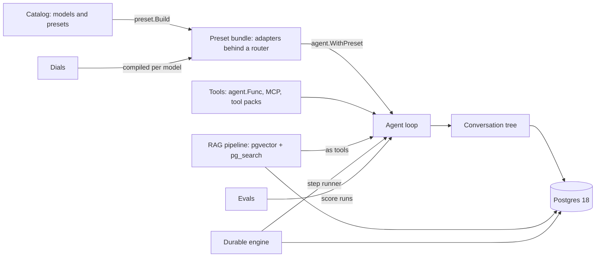

# Concepts

The words saige uses, and how the pieces connect. Each section links to the guide that covers it in depth.

- [How the pieces fit](#how-the-pieces-fit)
- [Vendors, runtimes and adapters](#vendors-runtimes-and-adapters)
- [Glossary](#glossary)

## How the pieces fit

An **agent** runs the loop: call the model, run the tools it asks for, send the results back, repeat until it answers. The **catalog** says what each model accepts and names **presets**, ordered chains of complete configurations. `preset.Build` turns a preset into **adapters** behind one router, so a failover moves to another configuration someone wrote. **Dials** state intents such as "focused" or "think hard" and are compiled for whichever model serves each attempt. **RAG** and the knowledge graph plug in as tools. A **durable engine** journals each model and tool step so a crashed run resumes. **Evals** score agents, retrieval and graphs with the same interfaces. Postgres 18 holds the durable state: conversation trees, RAG documents, the knowledge graph and duraturo runs.

## Vendors, runtimes and adapters

"Provider" is overloaded, so these docs use four terms:

| Term | Meaning | Examples |
| --- | --- | --- |
| **Model vendor** | A company that trains models and sells API access to them | Anthropic, OpenAI, Google |
| **Runtime** | Software that serves open-weight models you run yourself | Ollama, and OpenAI-compatible servers such as vLLM or llama.cpp |
| **Serving API** | The wire protocol an adapter speaks | Anthropic Messages; OpenAI Chat Completions and Responses; the Gemini API and Vertex AI; Ollama's native API; OpenAI-compatible endpoints |
| **Model** | The weights that answer, served by a vendor or a runtime | claude-haiku-5-5, gpt-6-luna, gemini-3.1-flash-lite; qwen3.5:4b run through Ollama |
| **saige adapter** | A Go type implementing the `types.Provider` interface for one serving API | `anthropic.Adapter`, `openai.Adapter` (Chat Completions) and `openai.ResponsesAdapter`, `google.Adapter` (Gemini API or Vertex AI), `ollama.Adapter` |

The interface is named `Provider` and the adapters live under `agent/provider/`, but an adapter does not have to target a vendor: `ollama.Adapter` targets a local runtime, and `openai.WithBaseURL` points the OpenAI adapter at any OpenAI-compatible server. The CLI's `--provider` flag likewise names an adapter: `--provider ollama` means "serve through a local Ollama runtime", and `--model` picks the model it serves.

Embeddings follow the same split. Anthropic has no embedding API, so a RAG setup that chats with Claude embeds through OpenAI, Google or a model on Ollama.

## Glossary

| Concept | One line | Guide |
| --- | --- | --- |
| Agent | The streaming loop: model turn, tool calls, results, repeat | [agent/README.md](../agent/README.md) |
| Adapter | `types.Provider` implementation for one serving API | [agent/README.md](../agent/README.md#provider-interface) |
| Catalog and presets | Model capabilities and named provider chains, as data | [catalog.md](catalog.md) |
| Dials | Model-neutral settings compiled per attempt | [dials.md](dials.md) |
| Tools | Client tools, server tools, parallelism and tool choice | [tool-calling.md](tool-calling.md), [func-tools.md](func-tools.md) |
| Delegation | Handoffs and sub-agents | [delegation.md](delegation.md), [orchestration-policies.md](orchestration-policies.md) |
| Approvals | Gates, markers, grants and denial limits | [approval-policy.md](approval-policy.md) |
| RAG | Ingest, chunk, embed, hybrid search, citations | [rag/README.md](../rag/README.md) |
| Knowledge graph | Entity and relation extraction as a RAG backend | [rag/knowledge/README.md](../rag/knowledge/README.md) |
| Evals | Scorers, gates, comparisons, live harness | [eval/README.md](../eval/README.md) |
| Durable runs | Resume after a crash, saved approvals, budget receipts | [durable-execution.md](durable-execution.md) |
| Deployment | One Postgres 18 with pgvector and pg_search | [deployment.md](deployment.md) |
