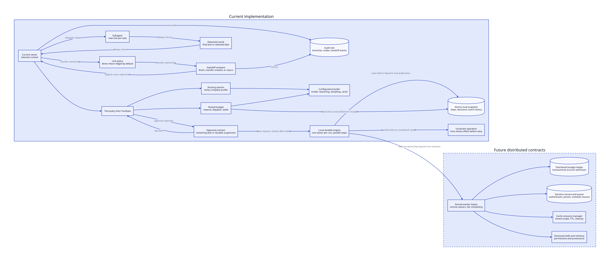

# Conversation ownership and policies

A branch, a subagent, and a handoff have different ownership rules.

| Term | Context | Control | Result |
| --- | --- | --- | --- |
| Branch | Alternate path in one tree | The host selects the path | A conversation revision |
| Subagent | A new tree for each task | The caller waits; sibling tasks can run | A result always returns to the caller |
| Handoff | An owner-specific view of the audit tree | Ownership moves to the recipient | The recipient finishes, transfers onward, or transfers back |
| Route | One complete provider configuration | Selection occurs before a provider request | A stream from that configuration |
| Interrupt | One pending approval | That call waits for a decision | Approval, denial, or cancellation |

A branch is not a worker or a security boundary. A separate tree isolates message state.
It does not isolate a database, an MCP server, or a mutable tool implementation.
The host must supply those boundaries.



## Subagent results

`delegate_to_<name>` starts a new child. `InvokeSubAgent` starts the same child directly from a service.
The default result contains only the final assistant text. Intermediate text remains in the trace.

```go
parent := agent.NewAgent(agent.AgentConfig{
    Name: "coordinator",
    SubAgents: []agent.SubAgentDef{{
        Name: "extract",
        Provider: model,
        SystemPrompt: "Return the requested fields as JSON.",
        ResultSink: myResultStore,
    }},
})
stream, err := parent.InvokeSubAgent(ctx, "extract", "Extract the invoice number.")
if err != nil { return err }
for delta := range stream.Deltas() {
    consume(delta)
}
result, err := stream.SubAgentResult()
// Inspect result even when err is non-nil. It contains the partial tree.
```

`SubAgentResult` contains an invocation ID, timestamps, a branch ID, output, error, and native JSON trace.
`Messages()` returns the visible messages. `Node(id)` reads any retained node.
`Tree()` creates an independent tree for inspection.
Each read owns its data. A reader cannot change another reader's result.

A `SubAgentResultPolicy` selects the parent tool result. A service can validate JSON or select specific messages.
Use the child's `WithResponseSchema` option when the provider supports a schema.
Validate the final data in the result policy before another service uses it.
A prompt or schema alone does not establish business validity.

A `SubAgentResultSink` saves the complete result before the caller receives success.
A save error fails the delegation. The sink must implement atomic writes, access scope, and retention limits.
Sinks and policies can run concurrently. A cancelled call passes a cancelled context to the sink.
A sink that must save cancelled results needs its own bounded cleanup context.

A failed child has no successful output. Its trace includes committed messages before the failure.
The tree does not contain unfinished token fragments from a failed provider stream.
Read the live deltas if those fragments are required.
Without a sink, a direct caller retains the result through its stream handle.
A model-driven delegation retains only its selected result in the parent tree.

## Handoffs and return links

Each member and the entry agent require a name. A handoff is not a subagent with a different name. No caller waits for an automatic return.
The recipient owns the next turn. It can finish the task or select another owner.
If it cannot proceed, it calls `handoff_to_<previous-owner>` with the missing data in `reason`.

The default `OwnerContext` sends the shared root instruction, the recipient's own earlier turns, and transfer briefs.
A new recipient also receives the latest user task.
The audit tree retains all owners' messages. A returning owner resumes its own earlier view.
`FullHandoffContext` explicitly restores the previous full-context behavior.
A custom `HandoffContextPolicy` can select a stricter brief.

`DirectReturnLinks` adds a reverse edge for each declared handoff edge.
A specialist can therefore return to any agent that can send work to it.
`DirectedLinks` preserves the declared graph without reverse edges.
Use it when a reverse edge crosses a trust boundary.
A return edge permits a transfer. It does not force the model to use it.

The shared root instruction is visible to every member. Do not place owner-private data in that root.
Put private tool results in that owner's turns or a separate service.
A handoff group runs one owner at a time in the current process.
Independent processes, durable ownership transfer, and remote handoff workers are future work.

The transfer limit stops repeated handoffs. The iteration limit also applies.
Multiple handoff calls in one turn are ambiguous. Saige rejects that tool batch before execution.
Automatic compaction is rejected for handoff groups until compaction has per-owner checkpoints.
A shared summary would lose ownership boundaries and could expose another owner's context.

## Routing and model configurations

A routing profile contains an ID and a complete configured provider.
Each profile retains its own endpoint, model, reasoning, sampling, and cache options.
A profile ID should include a configuration revision.

```go
routes, err := router.New(router.Config{
    Profiles: []router.Profile{
        {ID: "fast-v1", Provider: fastProvider},
        {ID: "deep-v3", Provider: reasoningProvider},
    },
    Required: []types.Capability{types.CapTools},
})
if err != nil { return err }
worker := agent.NewAgent(agent.AgentConfig{Provider: routes.Session()})
```

Each conversation owner needs its own `Session`. Subagents and handoff members create independent routing sessions.
The immutable provider clients can remain shared.
Retry, fallback, response-cache, and telemetry decorators preserve the session factory.
A custom decorator must preserve `SessionProvider` too.

Selection occurs after context and tool selection, before each provider request.
The router filters profiles by declared requirements, tool support, and schema support.
It then calls the routing policy once to obtain the attempt order.
A custom policy can use cost, latency, or task class through its own configuration.

The default `Sticky` policy retains the selected profile.
A transient failure permits another eligible profile. Cancellation does not trigger failover.
After partial output or usage, the current request fails without replay on another profile.
The next request can select another profile. Saige does not silently probe the primary again.
A changed requirement can remove the previous profile from the eligible set.

A routing session rejects overlapping requests with `ErrSessionBusy`.
Use separate sessions for independent parallel tasks.
`RouteDelta` identifies the selected profile for each provider attempt.
`Candidates()` reports each profile's capabilities. `Session.Capabilities()` reports their common contract.
The common price estimate uses the conservative rate card across profiles.

For a routing session, `ConfigContent.Model` selects a profile ID.
It never applies one provider's generation settings to a different model.
A plain provider can still be used without a router.

## Tool, skill, and memory policies

| Policy | Current contract | Limit |
| --- | --- | --- |
| `ToolPolicy` | Select visible and executable tools per owner and turn | Tool selection does not establish a connection |
| `ToolGate` | Allow, deny, modify, or request approval before a local call | Provider-hosted calls bypass the local gate |
| `SubAgentResultPolicy` | Select and validate returned data | The host defines the schema and size limits |
| `HandoffContextPolicy` | Select recipient context | The host must preserve valid tool-call pairs |
| `LinkPolicy` | Define directed control-transfer edges | One handoff owner runs at a time |
| Router `Policy` | Order eligible complete profiles | No distributed load scheduler |
| `BudgetPolicy` | Track usage and stop, warn, or request approval | No reservation ledger |

The default tool policy exposes all tools in stable name order.
A custom policy can expose discovery tools first, then selected tools on later turns.
This is lazy disclosure. It does not yet provide lazy MCP connection creation.
Registry membership is copied per agent. Tool objects and external services can still be shared.

A future skill resolver needs a versioned manifest, permission requirements, content hash, and scope.
Skill text belongs in selected context. It must not grant tool permissions by itself.
A future memory service needs tenant scope, provenance, expiry, and explicit write permission.
Memory retrieval is external input. It must not silently become a system instruction.

Local MCP clients, connection pools, and the `saige-mcp` server already exist.
Local MCP calls use ordinary tool execution and gates.
Google native search and code execution have adapter support.
OpenAI and Anthropic catalog entries describe model-native tools, but their current adapters do not wire all those tools.
Model capability, adapter support, and deployment permission must all agree before a feature is usable.
Provider-side remote MCP does not pass through local tool gates or the local step journal.

## Approval interrupts and parallel work

`MarkerDelta` creates one pending approval per call. Saige does not aggregate approvals.
The consumer calls `ResolveMarker` or `ResolveMarkerWithMessage` with the interrupt ID.
Registration occurs before event delivery. Duplicate decisions do not block the consumer.
A subagent marker uses a parent-call prefix and routes the decision back to the correct child.

The wait parks a goroutine. It does not occupy an OS thread while idle.
Other tool calls can run, but the paused call retains its parallel-tool slot.
The parent waits for the complete tool batch before its next model turn.
With sequential tools or a durable step runner, later tools in that batch wait too.
The consumer must drain events. A full event buffer applies backpressure to producers.

Pending decisions are in memory. Process failure loses them.
A durable interrupt service needs these operations:

1. Save the interrupt with the run ID, call ID, owner, arguments, and policy revision.
2. Commit the waiting state and release the worker lease.
3. Accept one authenticated decision with an idempotency key.
4. Resume the exact continuation with a new worker lease.
5. Reject stale decisions after cancellation, expiry, or policy changes.

Aggregation belongs in that service. It must preserve a separate decision for each call.
A human decision must not approve future calls or different arguments by accident.

## Budget and failure limits

Subagents share the parent `Budget` by default. Handoffs use the entry agent's budget.
`BudgetPolicy` supports cost, token, and request limits, warnings, and approval grants.
An explicit child budget replaces the shared budget. It does not form a hierarchical budget.
Use the shared budget until parent-and-child admission is implemented.

Usage is counted after a call. Parallel calls can exceed the limit together.
The agent checks a stopped budget before another request, but this check does not reserve funds.
Failed requests with missing usage, provider-native tool fees, and explicit-cache storage need separate accounting.
Durable replay does not restore a budget ledger or routing affinity.
A monetary approval grant does not increase token or request limits.

Before distributed execution, add a durable reservation ledger with atomic admission, settlement, and uncertain-charge states.
Also add ownership leases, duplicate-result handling, per-owner context checkpoints, and bounded event retention.
Do not use a cache entry as the source of truth for any of those states.
