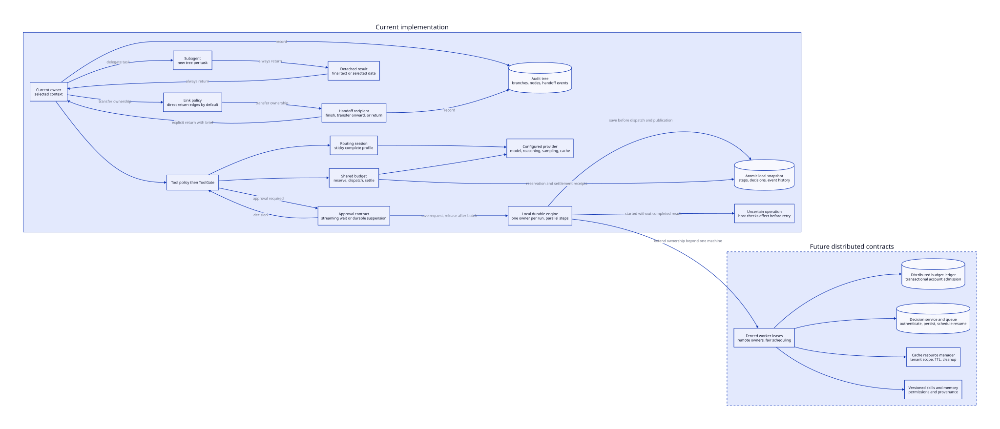

# Conversation ownership and policies

A branch, a subagent, and a handoff have different ownership rules.

| Term | Context | Control | Result |
| --- | --- | --- | --- |
| Branch | Alternate path in one tree | The host selects the path | A conversation revision |
| Subagent | A new tree for each task | The caller waits; sibling tasks can run | A result always returns to the caller |
| Spawned subagent | A new tree for each task | The caller continues and holds a handle | The result returns at the next safe point or through `await_subagent` |
| Handoff | An owner-specific view of the audit tree | Ownership moves to the recipient | The recipient finishes, transfers onward, or transfers back |
| Route | One complete provider configuration | Selection occurs before a provider request | A stream from that configuration |
| Interrupt | One pending decision: approval, budget, or clarification | That call waits for a decision | Approval, denial, an answer, expiry, or cancellation |

A branch is not a worker or a security boundary. A separate tree isolates message state.
One run may be active per branch. A second `Invoke` or `RunDurable` on a busy branch fails with `ErrRunActive`.
Runs on different branches of one tree may overlap.
It does not isolate a database, an MCP server, or a mutable tool implementation.
The host must supply those boundaries.



## Subagent results

Iteration budgets, private scratch, and passing large tasks and results by reference are covered in [delegation](delegation.md).

`delegate_to_<name>` starts a new child. `InvokeSubAgent` starts the same child directly from a service.
The default result contains only the final assistant text. Intermediate text remains in the trace.

```go
parent := agent.NewAgent(agent.AgentConfig{
    Name: "coordinator",
    SubAgents: []agent.SubAgentDef{{
        Name: "extract",
        Provider: model,
        SystemPrompt: "Return the requested fields as JSON.",
        ResultSink: myResultStore,
    }},
})
stream, err := parent.InvokeSubAgent(ctx, "extract", "Extract the invoice number.")
if err != nil { return err }
for delta := range stream.Deltas() {
    consume(delta)
}
result, err := stream.SubAgentResult()
// Inspect result even when err is non-nil. It contains the partial tree.
```

`SubAgentResult` contains an invocation ID, timestamps, a branch ID, output, error, and native JSON trace.
`Messages()` returns the visible messages. `Node(id)` reads any retained node.
`Tree()` creates an independent tree for inspection.
Each read owns its data. A reader cannot change another reader's result.

A `SubAgentResultPolicy` selects the parent tool result. A service can validate JSON or select specific messages.
Set `SubAgentDef.ResponseSchema` to make the child answer with JSON.
The child uses native structured output when its provider supports it and the `final_answer` tool otherwise.
Without a result policy, `SchemaResult` validates the answer and returns it as compact JSON. A mismatch fails the delegation.
`DecodeOutput[T]` decodes a direct caller's result.
Validate business rules in a custom result policy before another service uses the data.
A prompt or schema alone does not establish business validity.

A `SubAgentResultSink` saves the complete result before the caller receives success.
A save error fails the delegation. The sink must implement atomic writes, access scope, and retention limits.
Sinks and policies can run concurrently. A cancelled call passes a cancelled context to the sink.
A sink that must save cancelled results needs its own bounded cleanup context.

### Child context

| `SubAgentDef.Context` | The child starts with |
| --- | --- |
| `ContextTaskOnly` (default) | The task alone |
| `ContextFork` | The parent's branch up to the delegating turn, then the task |
| `ContextFiltered` | The messages `ContextFilter` selects from that same history, then the task |

A forked child keeps its own system prompt. The delegating turn is left out because its tool calls have no results yet. Thinking blocks are left out because their signatures belong to the provider that wrote them.
`TextMessagesOnly` is a ready filter: it keeps user and assistant text and drops tool traffic, so no call can lose its result.
A service that calls `InvokeSubAgent` has no delegating turn, so its child always starts with the task alone.

Every child's first message starts with a `<caller>` block: the call path, the depth, a reminder that its final message is its whole result, and the ancestors it must not delegate back to. `OmitCallerBlock` leaves it out.
The block is guidance. The loop itself refuses a delegation or spawn whose target is already on the call path, with `ErrAncestorDelegation`.

The parent's `ToolTimeout` applies to each tool call the child makes, not to the whole delegation.
Set `SubAgentDef.Timeout` to bound a complete child run. Time spent waiting for an approval does not count.

A failed child has no successful output. Its trace includes committed messages before the failure.
The tree does not contain unfinished token fragments from a failed provider stream.
Read the live deltas if those fragments are required.
Without a sink, a direct caller retains the result through its stream handle.
A model-driven delegation retains only its selected result in the parent tree.

## Background subagents

Set `Mode: agent.SubAgentSpawn` to run a child while the parent keeps working.

```go
lead := agent.NewAgent(agent.AgentConfig{
    Name:     "lead",
    Provider: model,
    SubAgents: []agent.SubAgentDef{{
        Name:        "researcher",
        Description: "Research one question in depth.",
        Mode:        agent.SubAgentSpawn,
        Context:     agent.ContextFork,
        Timeout:     5 * time.Minute,
    }},
})
```

| Tool | Effect |
| --- | --- |
| `spawn_<name>(task)` | Starts the child and returns `{"handle", "name", "status"}` at once |
| `await_subagent(handle)` | Waits for the child and returns its result. The result is not delivered again |
| `send_subagent(handle, message)` | Steers the running child. The message joins it at its next safe point |
| `cancel_subagent(handle)` | Stops the child. Its result is not delivered |
| `list_subagents()` | Lists handles, names, status, and tasks |
| `search_subagent(handle, query, k)` | Ranks a finished child's messages with BM25 and returns indexes with excerpts |
| `read_subagent(handle, index, window)` | Returns up to 20 messages of a finished child's transcript |

A result the parent did not await is appended as a `<subagent_result>` user message at the parent's next safe point, in completion order, and reported with `InjectedDelta{Mode: "subagent"}`.
The run does not finish while a child runs or its result is undelivered. It waits where it would finish and resumes with the result.
A run that ends by an error, cancellation, or a stop tool cancels its children before its stream closes.
Child deltas reach the parent stream as `ToolExecDelta` under the spawn call ID. Child approvals and clarifications reach the parent's consumer as they do for a delegation.
`EventStream.SubAgents` returns the run's handles. A handle offers `Wait`, `Send`, `Cancel`, `Status`, and `Interrupts`.
The search and read tools also accept the call ID of a finished `delegate_to_<name>` call when the agent has a spawn definition.

Each spawn reserves budget under its handle before the child starts. The child's first provider call uses the reservation, and an unused one is released when the child ends.
When other calls hold the allowance, the spawn fails with `ErrBudgetBusy` in its tool result. It does not queue.
Spawning needs the inline runner. Under a durable step runner the spawn tool returns `ErrSpawnUnsupported`, because a replay cannot rebuild a child that outlived its step.

## Structured output

`Structured[T]` runs an agent and returns its answer decoded into `T`.
The schema comes from `OutputSpec.Schema` or is derived from a struct `T`. It applies to these runs only.

```go
type Invoice struct {
    Number string  `json:"number"`
    Total  float64 `json:"total"`
}
inv, res, err := agent.Structured(ctx, worker, []types.Message{types.NewUserMessage(doc)}, agent.OutputSpec[Invoice]{
    Repair:   2,
    Validate: func(i Invoice) error { if i.Total < 0 { return errors.New("total is negative") }; return nil },
    OnDelta:  render, // receives PartialJSONDelta as the answer streams
})
if errors.Is(err, agent.ErrSchemaInvalid) { /* every repair failed */ }
```

| Mode | How the schema reaches the model | Use when |
| --- | --- | --- |
| `native` | Provider structured output; with tools, one extra tool-free turn | The provider supports a schema |
| `tool` | A `final_answer` tool next to the agent's tools | The agent has tools, or the provider lacks a native schema |
| `prompt` | A schema instruction in the system prompt for each request | The model has neither |

`OutputAuto` picks `tool` when the agent has tools, then `native`, then `tool`, then `prompt`.
An explicit mode the provider cannot honor fails with `ErrInvalidModelConfig`.

The answer is the final text, or the `final_answer` result. `ExtractJSON` removes `<think>` blocks, code fences, and surrounding prose.
The value is checked against the schema, recursively, and then by `Validate`.
A failure is sent back to the model with the error, up to `Repair` times. All attempts extend the active branch.
In `tool` mode an invalid call is answered with a tool error inside the run, before any repair turn.
`WithResponseSchema` with `WithOutputMode(OutputTool)` or `OutputPrompt` also checks a final text answer without `Structured`. A mismatch is sent back up to twice per user turn, then the run fails with `ErrSchemaInvalid`.
`PartialJSONDelta` carries a complete, parseable prefix of the answer while it streams. Each one replaces the last.

`Collect` drains any stream into a `Transcript`: the last turn's text, all text, tool calls, tool errors, turns, time to first token, total time, and summed usage.
`CollectText` returns only the answer text and the run error.

## Handoffs and return links

Each member and the entry agent require a name. A handoff is not a subagent with a different name. No caller waits for an automatic return.
The recipient owns the next turn. It can finish the task or select another owner.
If it cannot proceed, it calls `handoff_to_<previous-owner>` with the missing data in `reason`.
The handoff tool also takes `message`, a handover note the previous owner writes for the recipient, and `context`, data the recipient cannot see in its own view.
Both are stored on the `HandoffContent` node and appended to the recipient's transfer brief.

The default `OwnerContext` sends the shared root instruction, the recipient's own earlier turns, and transfer briefs.
A new recipient also receives the latest user task.
The audit tree retains all owners' messages. A returning owner resumes its own earlier view.
`FullHandoffContext` explicitly restores the previous full-context behavior.
A custom `HandoffContextPolicy` can select a stricter brief.

`DirectReturnLinks` adds a reverse edge for each declared handoff edge.
A specialist can therefore return to any agent that can send work to it.
`DirectedLinks` preserves the declared graph without reverse edges.
Use it when a reverse edge crosses a trust boundary.
A return edge permits a transfer. It does not force the model to use it.

The shared root instruction is visible to every member. Do not place owner-private data in that root.
Put private tool results in that owner's turns or a separate service.
A handoff group runs one owner at a time in the current process.
Independent processes, durable ownership transfer, and remote handoff workers are future work.

The transfer limit stops repeated handoffs. The iteration limit also applies.
Multiple handoff calls in one turn are ambiguous. Saige rejects that tool batch before execution.
Automatic compaction is rejected for handoff groups until compaction has per-owner checkpoints.
A shared summary would lose ownership boundaries and could expose another owner's context.

## Routing and model configurations

A routing profile contains an ID and a complete configured provider.
Each profile retains its own endpoint, model, reasoning, sampling, and cache options.
A profile ID should include a configuration revision.

```go
routes, err := router.New(router.Config{
    Profiles: []router.Profile{
        {ID: "fast-v1", Provider: fastProvider},
        {ID: "deep-v3", Provider: reasoningProvider},
    },
    Required: []types.Capability{types.CapTools},
})
if err != nil { return err }
worker := agent.NewAgent(agent.AgentConfig{Provider: routes.Session()})
```

Each conversation owner needs its own `Session`. Subagents and handoff members create independent routing sessions.
The immutable provider clients can remain shared.
Retry, fallback, response-cache, and telemetry decorators preserve the session factory.
A custom decorator must preserve `SessionProvider` too.

Selection occurs after context and tool selection, before each provider request.
The router filters profiles by declared requirements, tool support, and schema support.
It then calls the routing policy once to obtain the attempt order.
A custom policy can use cost, latency, or task class through its own configuration.

The default `Sticky` policy retains the selected profile.
A transient failure permits another eligible profile. Cancellation does not trigger failover.
After partial output or usage, the current request fails without replay on another profile.
The next request can select another profile. Saige does not silently probe the primary again.
A changed requirement can remove the previous profile from the eligible set.

A routing session rejects overlapping requests with `ErrSessionBusy`.
Use separate sessions for independent parallel tasks.
`RouteDelta` identifies the selected profile for each provider attempt.
`Candidates()` reports each profile's capabilities. `Session.Capabilities()` reports their common contract.
The common price estimate uses the conservative rate card across profiles.

For a routing session, `ConfigContent.Model` selects a profile ID.
It never applies one provider's generation settings to a different model.
`Session.WithModel(id)` returns a pinned view that shares the session's state, so the pin keeps the sticky history, failure counts and failover order.
The agent calls `WithModel` on every turn the conversation names a model, also when the session already reports that profile, so the pin is recorded in `RouteState`. `Unpin` clears it.
A plain provider can still be used without a router.

### Session policies, locks and failover

`Config.SessionPolicy` takes a `SessionRouterPolicy`, which orders profiles from the session's `RouteState` (sticky profile, pin, last attempt and failures).
`Affinity` prefers profiles in configuration order and stays on one profile until it fails `FailThreshold` times in a row, then moves on; `ReprobeAfter` retries the preferred profile later, unless `SwitchCost` (rewriting a warm prompt-cache prefix at the new profile's rate) exceeds `MaxSwitchCost`.

Route locks keep a conversation on the profile that holds its state:

| Lock | Kind | Meaning |
| --- | --- | --- |
| `tool_loop` | soft | The last message carries tool results |
| `signed_reasoning` | hard | The turn continues signed reasoning that must return to the model that produced it |
| `context_cache` | soft | The profile's provider holds a bound context cache (reported through `LockReporter`, found through decorators) |

A soft lock blocks voluntary switches but allows failover. A hard lock also blocks failover and outranks a pin: the request fails rather than reach a profile that would misread it.

Failover is classified: `router.DefaultFailoverOn` fails over on transient errors and on context-length errors, and a context-length failure only moves to a profile with a larger context window. Content-filter refusals do not fail over unless `Config.FailoverOn` accepts them.

`Session.RouteState()` and `Session.RestoreRouteState(st)` save and restore a session's routing state. The host stores it with the conversation and restores it when the session is rebuilt, so a restart keeps the same profile and warm prefix. A state written under another `Config.Revision` keeps only its profiles; counters, warm prefix and locks start over. Profiles the router no longer defines are dropped.

### Traffic splits

`agent/provider/split` assigns each session to one of several weighted arms, deterministically by `Config.Key` (a user or conversation ID) and `Salt`. The assignment is sticky for the session, and `RouteDelta` carries the experiment and variant.
An arm with `Canary` set is guarded: once the failure fraction of recent attempts exceeds `MaxErrorRate`, the canary is demoted to the control arm until `ResetCanary`. A canary failure accepted by `FailoverOn` is retried on the control arm when nothing was forwarded yet.
A `ShadowArm` mirrors a sample of requests to another provider. Shadow calls spend from their own required `Budget`, never execute tools, and report through `OnShadow`.
`split.Force(ctx, experiment, label)` pins a request to one arm, which offline evaluation uses to exercise each production arm.

### Outcome policy

An `OutcomePolicy` decides whether a result should move the conversation to another model.
It sees `schema_invalid` from `Structured` after its repairs run out, and `subagent_failed` after a failed delegation.
A returned `Switch` is recorded as `ConfigContent{Model, Reason}` on the branch, so later turns use it.
The stream reports it as a `RouteDelta` whose `Reason` names the outcome.

```go
worker := agent.NewAgent(cfg, agent.WithOutcomePolicy(types.EscalationLadder{
    Models: []string{"fast-v1", "deep-v3"},
    Kinds:  []types.OutcomeKind{types.OutcomeSchemaInvalid, types.OutcomeSubagentFailed},
}))
```

`EscalationLadder` moves one step up and stops at the top. For a routing session, the model names a profile ID.
The provider must implement `ModelSwitcher` for the switch to take effect, as for any `ConfigContent.Model`.
Cancellation is never reported as an outcome. Sub-agents do not inherit the policy.

## Tool, skill, and memory policies

| Policy | Current contract | Limit |
| --- | --- | --- |
| `ToolPolicy` | Select visible and executable tools per owner and turn | Tool selection does not establish a connection |
| `ToolGate` | Allow, deny, modify, or request approval before a local call. `Gates` ranks deny over approval over allow | Provider-hosted calls bypass the local gate |
| `SubAgentResultPolicy` | Select and validate returned data | The host defines the schema and size limits |
| `HandoffContextPolicy` | Select recipient context | The host must preserve valid tool-call pairs |
| `LinkPolicy` | Define directed control-transfer edges | One handoff owner runs at a time |
| Router `Policy` | Order eligible complete profiles | No distributed load scheduler |
| `BudgetPolicy` | Reserve capacity, settle usage, stop, warn, or request approval | Shared process-local ledger; host-supplied per-call bounds |

The default tool policy exposes all tools in stable name order.
A custom policy can expose discovery tools first, then selected tools on later turns.
This is lazy disclosure. It does not yet provide lazy MCP connection creation.
Registry membership is copied per agent. Tool objects and external services can still be shared.
Policies and tools read `agent.RunScopeFromContext` to keep state per owner and per conversation. `RunScope.Conversation` is the tree's root node ID, so two conversations of agents with the same name, and two delegations to one sub-agent, get different keys.

### Tool search

`selector.DeferredTools` sends only pinned tools and `tool_search` until the model searches.

```go
deferred := selector.NewDeferredTools("read_file")
worker := agent.NewAgent(agent.AgentConfig{
    Provider: model,
    Tools:    types.NewToolRegistry(append(manyTools, deferred.Tool())...),
}, agent.WithToolPolicy(deferred))
```

`tool_search(query, k)` returns the full schemas of the best matches. They are sent from the next turn for the rest of the conversation.
Ranking uses `selector.BM25` over the name, description, and parameters. Replace it with `DeferredTools.Search`.
Discovery is held in memory. A run resumed in another process starts with the pinned tools again.
Every discovered call still passes the gate.

### Capability classes and quotas

```go
gate := types.Gates(types.CapabilityGate(nil), myArgumentGate)
budget := types.NewBudget(policy).ToolQuota("web_search", 20)
worker := agent.NewAgent(cfg, agent.WithToolGate(gate), agent.WithBudget(budget))
```

| Capability | Default outcome |
| --- | --- |
| `read` | Allow |
| `write` | Require approval |
| `destructive` | Deny |
| `unknown` or unset | Require approval |

A class missing from a custom `CapabilityPolicy` requires approval.
The gate trusts each tool's declaration. Tools from MCP servers usually declare nothing and land in `unknown`.
A quota is charged when a call is cleared to run. A call over the quota gets an `ErrToolQuotaExceeded` error result and counts toward `MaxConsecutiveErrors`.

### Skills

```go
sources := append(skills.StandardSources(projectDir, homeDir, skills.Untrusted()),
    skills.NewFSSource("builtin", embeddedSkills, "skills"))
catalog, err := skills.NewCatalog(ctx, sources)
if err != nil { return err }
for _, p := range catalog.Problems() { log.Warn("skipped skill", "error", p) }
worker := agent.NewAgent(cfg, skills.WithSkills(catalog, skills.AllowListPolicy{
    Default: skills.AllowAll(),
    Owners:  map[string]skills.AllowList{"reviewer": skills.AllowNames("code-review")},
    Parents: map[string]string{"reviewer": "coordinator"},
}))
```

| Tier | Delivery |
| --- | --- |
| Name and description | The system prompt, up to 50 skills, then a pointer to `search_skills` |
| Instructions | `load_skill(name)` returns the body and a resource manifest as a tool result |
| Resources | `read_skill_resource(name, path)` returns one listed UTF-8 file, 256 KiB by default |

Snapshots are taken when the catalog is built. Build a new catalog to pick up changes on disk.
A package with an invalid header, a name that differs from its directory, a link outside its root, or a size over its bounds is skipped and reported by `Problems`.
Sources are read in order and the first definition of a name wins, but an untrusted definition never shadows a trusted one. Hidden definitions are reported by `Shadowed`.
While a loaded skill declares `allowed-tools`, each turn's tools are narrowed to that list. The skill tools and `tool_search` stay visible, and an inner `DeferredTools` searches only the allowed tools. `WithoutToolNarrowing` turns this off.
`WithSkills` wraps the tool policy present when it runs, so pass it after `WithToolPolicy`.
The listing is added to `AgentConfig.SystemPrompt`. For an agent given an existing tree, add `Toolset.Prompt` to that tree's system message.
The skill tools never execute a script.

### Workspace

```go
ws, err := workspace.NewDir(runDir)
if err != nil { return err }
tools := append(workspace.Tools(ws), workspace.Spill(searchTool, ws, workspace.SpillOptions{})) // 16 KiB threshold
worker := agent.NewAgent(agent.AgentConfig{Provider: model, Tools: types.NewToolRegistry(tools...)},
    agent.WithWorkspace(ws))
```

| Tool | Capability | Does |
| --- | --- | --- |
| `scratch_write(name, content)` | `write` | Stores text and returns a `saige-artifact://` URI |
| `scratch_read(ref, offset, limit)` | `read` | Reads by URI or name, 8 KiB by default and 64 KiB at most, with the next offset |
| `scratch_search(query, k)` | `read` | Returns lines that contain every query word |

Artifacts are addressed by SHA-256, so a repeated write is free and safe to replay. A name points at its latest content; older content stays readable by URI.
`workspace.Dir` writes through a temporary file and a rename. `workspace.Memory` is for tests and short runs.
`Spill` keeps a preview of an oversized result and stores the rest. If the store refuses the write, the full result is returned.
The preview and each `scratch_read` page end at a word boundary, so a value such as an email address is never split into fragments a redactor cannot recognize.
The loop attaches the workspace to every tool call, and the scratch tools prefer it over the one they were built with. Each sub-agent gets `View(true)`, so its writes fail with `ErrReadOnly`.

### Personal data

```go
vault := privacy.NewVault(nil) // built-in detectors; one vault per session
worker := agent.NewAgent(cfg, agent.WithToolRedactor(privacy.NewToolRedactor(vault)))
// Or keep data away from the vendor only:
model = privacy.NewProvider(model, vault)
```

| Label | Validated by |
| --- | --- |
| `EMAIL` | Pattern |
| `SECRET` | Known key prefixes |
| `CREDIT_CARD` | Length and Luhn |
| `SSN` | Area, group, and serial ranges |
| `IBAN` | Mod 97 |
| `IP_ADDRESS` | Octets of at most 255 |
| `PHONE` | 10 to 15 digits |

`ToolRedactor` restores placeholders just before a tool runs and tokenizes the result and any error inside the tool step. Gates, approvals, the tree, telemetry, and the provider see `<<EMAIL_1>>`, never the address. A result that cannot be redacted is withheld.
`privacy.Provider` tokenizes outgoing text, tool results, and tool arguments, and restores the response as it streams. It leaves thinking blocks alone and does not inspect file bytes.
`privacy.Chain` merges a named-entity detector with the built-in one. `Vault.Snapshot` and `LoadVault` carry the mapping across a resumed run; the snapshot contains the original values.

### Memory

```go
store, err := memory.NewFileStore(memDir)
if err != nil { return err }
policy := memory.Policy{
    Scope: func(ctx context.Context, owner string) (memory.Scope, error) {
        s := memory.Scope{Tenant: tenantFrom(ctx), Subject: userFrom(ctx)}
        if owner != "coordinator" { s = s.Narrow(owner).AsReadOnly() }
        return s, nil
    },
    Redact: func(ctx context.Context, text string) (string, error) { return privacy.Redact(ctx, nil, text) },
}
worker := agent.NewAgent(agent.AgentConfig{
    Provider: model,
    Tools:    types.NewToolRegistry(append(baseTools, memory.Tools(store, policy)...)...),
})
```

| Tool | Capability | Approval by default |
| --- | --- | --- |
| `recall(query, budget)` | `read` | No |
| `remember(content, kind, tags)` | `write` | Yes |
| `forget(id)` | `destructive` | Yes |
| `memory(command, ...)` on `/memories` | `write` | Yes, for every command |

The `memory` tool accepts `view`, `create`, `str_replace`, `insert`, `delete`, and `rename`. To approve only its writes, set `AutoApprove` and add `memory.CommandGate()` to the agent's gate. The gate still asks before every `remember`, `forget`, and `memory` command other than `view`.
The host sets the scope. A call without one fails with `ErrNoScope`. A scope sees its own namespace and those below it.
Writes pass `Policy.CheckContent`. Without `Redact`, content with a detected value fails with `ErrSensitive`. Tags pass the same check. File names chosen by `create` and `rename` pass `Policy.CheckName`, which rejects a detected value even with a redactor, because a redacted name no longer means the same thing. `Retention` sets an expiry, and expired records are not recalled.
A tool write uses the tool call ID as its idempotency key. Host code that extracts memories after a run calls `Policy.Remember`.
Recall is external input. `FormatRecords` wraps each record in a tag the content cannot close, and `InjectMessage` returns a user message for `RecallByInjection` inside an outer tag the content cannot close either.
`FileStore` reaches files through `os.Root`, so a path or link cannot leave the scope directory. `MemStore` and `NewFixture` serve tests and evals. `KGStore` writes episodes to a knowledge graph under a group derived from the scope; it matches that group exactly and needs a graph that can delete episodes for `Forget`.

Local MCP clients, connection pools, and the `saige-mcp` server already exist.
Local MCP calls use ordinary tool execution and gates.
Google native search and code execution have adapter support.
OpenAI and Anthropic catalog entries describe model-native tools, but their current adapters do not wire all those tools.
Model capability, adapter support, and deployment permission must all agree before a feature is usable.
Provider-side remote MCP does not pass through local tool gates or the local step journal.

## Approval interrupts and parallel work

`MarkerDelta` creates one pending decision per call. Saige does not aggregate approvals.
The consumer calls `ResolveMarker` or `ResolveMarkerWithMessage` with the marker's tool call ID.
Each marker also carries `Interrupt`: an ID unique within the run, the run ID, the path of tool call IDs from the root run, the kind, and the deadline.
`EventStream.ReplyInterrupt` answers by that ID, idempotently by ID and idempotency key. `PendingInterrupts` lists every open decision in the run, including those of delegated and spawned children.
`types.MarshalInterrupt` encodes an interrupt as a versioned envelope for a host that relays decisions elsewhere.
Registration occurs before event delivery. Duplicate decisions do not block the consumer.
A subagent marker uses a parent-call prefix and routes the decision back to the correct child.
`ResolveMarkerErr` returns `ErrUnknownMarker` for an ID that is not waiting, so a stale or mistyped decision is reported instead of lost.
Arguments edited during approval are validated and gated again. A gate can still deny the edited call.
An `agent.ApprovalPolicy` lets an approval carry a grant (once, tool, matching arguments, or session, with an optional expiry), stops asking after repeated denials, and applies capability-class defaults. See [approval policy and grants](approval-policy.md).

```go
worker := agent.NewAgent(cfg,
    agent.WithInterruptExpiry(10*time.Minute, types.InterruptPolicy{OnExpire: types.InterruptExpireEscalate}))
```

| `OnExpire` | An unanswered decision |
| --- | --- |
| `deny` (default) | Is refused. The model sees a refusal |
| `fail` | Stops the run with `ErrInterruptExpired` |
| `escalate` | Is posted once more to the caller one level up with a fresh deadline, then refused. A root run refuses at once |

A reply after the deadline returns `ErrInterruptExpired`. Without `WithInterruptExpiry` a decision has no deadline.

`agent.ClarificationTool()` registers `ask_user(question)`. A call posts a `clarification` interrupt whose payload holds the question.
Answer it with `ReplyInterrupt` and an `Answer`, or approve the marker with the answer as its message. The answer becomes the tool result, and a refusal becomes a tool error.
The wait follows the approval rules: no tool slot is held, `ToolTimeout` does not apply, and a run without a consumer or an `ApprovalRunner` fails at once.

The streaming wait parks a goroutine. It does not hold a regular tool execution slot.
Independent calls can run. The parent still waits for the complete tool batch before its next model turn.
`MaxParallelTools: 1` preserves strict ordering for streaming calls.
The consumer must drain events. A full event buffer applies backpressure to producers.

Use `agent/durable/local` or `agent/durable/duraturo` for persisted decisions and process recovery.
Pending approvals return `ErrSuspended` without holding a goroutine for the human decision.
The worker releases its run lock after active siblings finish and their results are saved.
A new worker uses the same run ID, revision, input, and fresh agent factory to resume.
The engine rejects conflicting decisions, changed revisions, cancellation, and expired pending approvals.
Non-streaming approvals require `ApprovalRunner`; unsupported runners fail instead of waiting for a missing consumer.
This includes approvals inside delegated children and the blocking subagent `Execute` path.
Both durable engines implement it.
Under a durable runner without it, child approvals stream as markers in the same way as parent approvals.

Aggregation belongs in the host. It must preserve a separate decision for each call.
See [durable execution](durable-execution.md) for recovery and deployment examples.

## Concurrency rules

| Type | Guarantee |
| --- | --- |
| `Agent` | Safe for concurrent `Invoke`, `Submit`, `Continue`, and `RunDurable` on different branches. One run holds a branch at a time, and a second gets `ErrRunActive` |
| `types.Tool` | Must be safe for concurrent `Execute`. Calls in one turn run at once, and two calls to the same tool run on one instance. `WithSequentialTools` runs them one at a time in request order |
| `ToolGate`, `ToolPolicy`, `SubAgentResultPolicy`, `SubAgentResultSink`, `MessageSelector` | Must be safe for concurrent use. Parallel calls and sibling sub-agents call them at once |
| `ToolRegistry` | Safe for concurrent use |
| `tree.Tree` | Safe for concurrent use. Runs on different branches of one tree may overlap |
| `EventStream` | `Submit`, `ResolveMarker`, `ReplyInterrupt`, `PendingInterrupts`, and `Cancel` are safe from any goroutine, including the one reading `Deltas` |
| `MemoryInterruptRouter`, `SubAgentHandle` | Safe for concurrent use |

A sub-agent gets a new `Agent` and tree for each call, but its tools are the instances in its definition. Sibling sub-agents can call one tool instance at the same time.
A shared `Budget` is safe for concurrent use. Its reservations are what stop concurrent children from spending the same allowance.
Run tests with `go test -race ./...`. A stateful tool that assumes serial calls fails only under load.

## Context overflow and step limits

Set `MaxInputTokens` to compact on input size instead of message count.

```go
a := agent.NewAgent(agent.AgentConfig{
    Provider: model,
    CompactCfg: &types.CompactConfig{
        Strategy:        types.CompactClearToolResults,
        MaxInputTokens:  150_000,
        KeepToolResults: 3,
        ExcludeTools:    []string{"read_memory"},
    },
    OnMaxIter:           agent.MaxIterForceFinal,
    MaxRepeatIterations: 3,
    StopAtTools:         []string{"submit_answer"},
})
```

| Setting | Effect |
| --- | --- |
| `MaxInputTokens` with `summarize` | Summarizes the older half of the branch onto a new branch |
| `MaxInputTokens` with `clear_tool_results` | Replaces all but the newest results with a stub, with no model call |
| `MaxInputTokens` with `sliding_window` | Keeps the system prompt and the last `WindowSize` messages |
| `AgentConfig.Tokenizer` | Measures input before the first usage report. The default estimates four characters per token |

Without `MaxInputTokens`, `clear_tool_results` runs on every turn and copies the history to a new branch each time it clears a result. Set a token limit for long runs.
Input size is the larger of the last reported prompt tokens and the estimate of the current history.
A turn is compacted at most once before it is sent. Compaction does not count as an iteration.
The summary call uses the active provider. It is reserved on the budget before it is sent, like a turn, and its usage is streamed as a `UsageDelta`.
A summary that would separate a tool result from its call is skipped before any model call. The `none` strategy never summarizes.
A context-length error from the provider compacts the branch and retries, up to three times.
Recovery needs a `CompactCfg`. Without one, or after three attempts, the run returns the first context-length error.
Handoff groups reject compaction, so they return the error at once.

A turn that stops at the output token limit is committed and reported with `TruncatedDelta`, which names the node and the finish reason.
Its tool calls never run. A truncated turn with tool calls fails the run with `ResponseTruncatedError`.

| Control | Default | At the limit |
| --- | --- | --- |
| `MaxIter` | 10 | `ErrMaxIterations` |
| `MaxConsecutiveErrors` | 2 turns where every call failed. Refused or rejected calls do not count | `ErrToolErrorLimit` |
| `MaxRepeatIterations` | Off | The repeated calls are not run. `ErrRepeatedToolCalls` |
| `OnMaxIter: MaxIterForceFinal` | Off | One tool-free call for a final answer replaces the error |

`StopAtTools` ends the run after a listed tool succeeds. `EventStream.StopToolCallID` names the call.
For a subagent, `FinalAssistantText` returns that tool's result. A failed call does not stop the run.

`AgentConfig.ToolChoice` and `ConfigContent.ToolChoice` set the provider tool choice.
A required or named choice applies to one turn and then reverts to auto. Auto and none apply to every turn.
A choice in the conversation takes precedence over the configured one.
A required or named choice needs a provider that implements `types.OptionsProvider`; otherwise the run fails with `ErrInvalidModelConfig`.
None is sent as an option when the provider declares tool choice. Otherwise the tools are withheld.

## Stop, queue, steer, and continue

A message sent while a run is active joins it at a safe point, where every tool call already has its result.

```go
stream := a.Invoke(ctx, []types.Message{types.NewUserMessage("draft the report")})

// Later, while the run streams:
id, err := stream.Submit(types.NewUserMessage("use metric units"), agent.SubmitSteer)

// Or by branch, which starts a run when the branch is idle:
stream, id, err = a.Submit(ctx, branch, types.NewUserMessage("then summarize it"), agent.SubmitQueue)
```

| Mode | When it joins | Effect |
| --- | --- | --- |
| `SubmitQueue` | Where the run would finish | A new user turn on the same stream, with fresh step limits |
| `SubmitSteer` | Next safe point, after any tool results | Seen by the next model call. Nothing is cancelled |
| `SubmitInterruptReplace` | At once while a provider call is in flight, otherwise at the next safe point | Stops the provider call. Its completed text is committed as truncated and its tool calls are dropped. Running tools finish first. The message starts a new user turn with fresh step limits |
| `SubmitSide` | At once, through `Agent.Submit` only | Branches from the last safe point and runs on a separate stream |

The stream reports `QueuedDelta` when a message is accepted and `InjectedDelta` with its node when it is appended. A run that `Agent.Submit` starts reports its message the same way.
`EventStream.Submit` never waits for the consumer, so it is safe to call from the goroutine that reads `Deltas`.
An interrupt also sends `InterruptedDelta` and `TruncatedDelta` with reason `interrupted`.
A message sent after the run's final safe point fails with `ErrRunFinished`; `Agent.Submit` then starts a new run.
Messages accepted but not appended, because the run ended at a limit, an error, or a stop tool, are returned by `EventStream.Undelivered`.
Replayed and remote streams, and runs under a durable step runner, return `ErrSubmitUnsupported`. A submitted message is not in the runner's recorded input, so a replay would rebuild a different transcript.
A run that compacts onto a new branch keeps its claim on that branch, so a submission to the active branch joins it.

`Agent.Continue` resumes a branch that ends with an assistant turn, such as one cut short by an interrupt or the output limit.
A provider that declares `CapAssistantPrefill` continues the partial turn. Any other receives `DefaultContinuePrompt`.
`WithAutoContinue(n)` resumes a text-only turn cut off by the output limit up to n times. A cut-off tool call still fails the run.

## Budget and failure limits

Subagents share the parent `Budget` by default. Handoffs use the entry agent's budget.
`BudgetPolicy` supports cost, token, and request limits, warnings, and approval grants.
An explicit child budget replaces the shared budget. It does not form a hierarchical budget.
Use the shared budget until parent-and-child admission is implemented.
Local durable runs reject separate child budgets because recovery receipts belong to one run ledger.

Each call reserves capacity before provider dispatch. `ErrBudgetBusy` means other calls hold the allowance.
`PerCallCost` and `PerCallTokens` must cover the complete configured request and any hidden retry attempts.
A zero bound reserves all remaining capacity for its enabled limit. This can serialize monetary or token admission.
The agent reports actual usage even if it exceeds a declared bound, then fails the attempt.
`BudgetWarn` records breaches and permits additional calls. It is not a spending control.

Missing usage consumes the reserved allowance and increments `Budget.Uncertain()`.
Local response-cache hits settle without a provider charge. Provider prompt-cache hits remain billable requests.
The four adapters identify cumulative usage snapshots so repeated totals are not summed again.
The local engine saves reservation and settlement receipts. Replay restores them into a fresh budget exactly once.
A monetary approval grant does not increase token or request limits.

Provider-native tool fees, explicit-cache storage, hidden retries, and incomplete price cards need host accounting.
Request limits count calls at the wrapped provider boundary; inner retry attempts need a separate attempt ledger.
Routing affinity is still in memory. Pin the provider configuration in a durable factory when replay must retain that route.
Distributed execution still needs a shared ledger, fenced ownership, context checkpoints, and bounded event retention.
Do not use a cache entry as the source of truth for these states.
